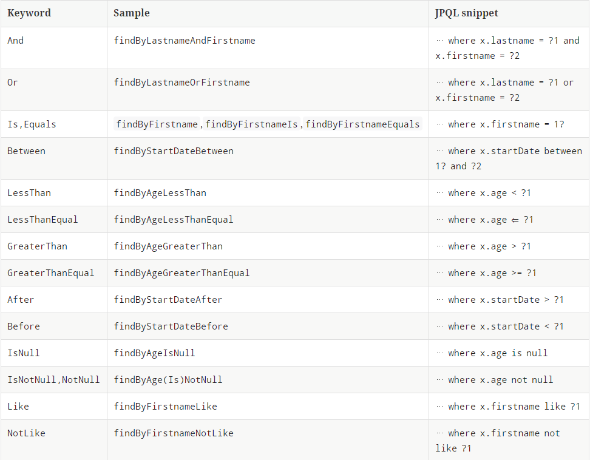
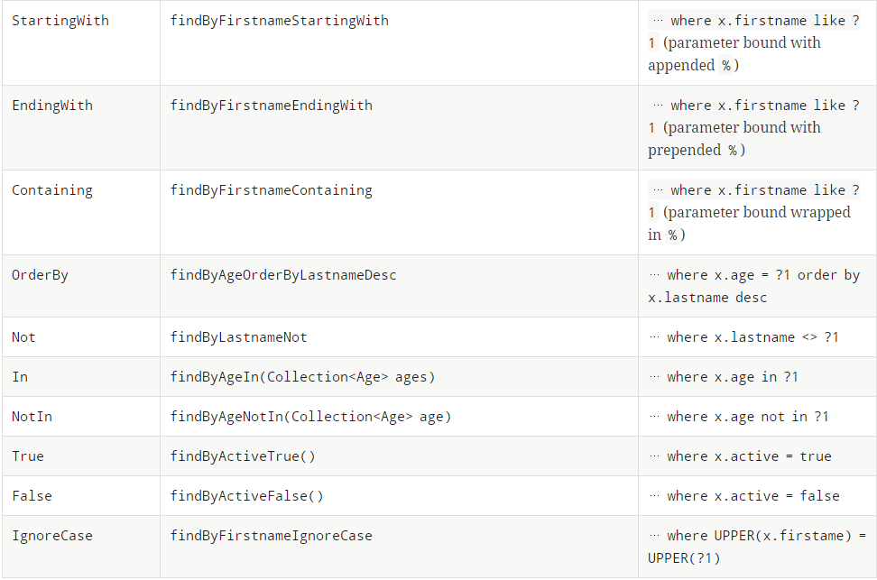

# 12장. 스프링 데이터 JPA

## Overview
* 대분분의 data 접근 계층은 유사한 등록, 수정, 삭제, 조회 코드를 반복해서 개발해야 함
* 이 문제로 generic과 상속을 사용해서 공통 부분을 처리하는 부모 클래스를 만들어 GenericDAO를 만들기도 함
    * 그러나, 공통 기능을 구현한 부모 클래스에 종속되고, 상속의 단점 노출

## 12.1 스프링 데이터 JPA 소개
* sprnig framework에서 JPA를 편리하게 사용할 수 있도록 지원하는 project
* CRUD를 처리하기 위한 공통 interface 제공
* repository를 개발할 때, interface만 작성하면 실행 시점에 구현 객체를 동적으로 생성해서 주입함
* data 접근 계층 개발 시, 구현 클래스 없이 interface만으로 개발 완료 가능
* org.springframework.data.jpa.repository.JpaRepository
```
public interface ItemRepository extends JpaRepository<Item, Long> {...}
```
* 스프링 데이터 프로젝트
    * spring data REDIS
    * spring data HADOOP
    * spring data JPA
    * spring data MONGO
    * spring data NEO4j
    * spring data GEMFIRE

## 12.2 스프링 데이터 JPA 설정
* 스프링 데이터 JPA는 applicatino을 실행할 때, basePackage에 있는 repository interface들을 찾아 interface를 구현한 클래스를 동적으로 생성 후, spring bean으로 등록함
```
@Configuration
@EnableJpaRepositories(basePackage = "com.nhnent.pflat.repository")
public class AppConfig { }
```

## 12.3 공통 인터페이스 기능
* JpaRepository 인터페이스 상속 후, 제너릭에 entity class와 사용하는 식별자 타입을 지정
```
public interface MemberRepository extends JpaRepository<Member, Long> { ... }
```
* 상속구조
    * Repository <- CrudRepository <- PagingAndSortingRepository <- JpaRepository
* 주요 메소드 (T: entity, ID: entity의 식별자, S: entity와 그 자식 타입)
    * save(S): 등록, 수정
        * entity의 식별자 유뮤로, persist() 또는 merge() 실행
    * delete(T): 삭제
    * findOne(ID): 단건 조회
    * getOne(ID): entity를 proxy로 조회
    * findAll(...): 모든 entity 조회, 정렬이나 페이징 조건 제공 가능

## 12.4 쿼리 메소드 기능
* 메소드 이름만으로 쿼리를 생성하는 기능
    * 메소드 이름으로 쿼리 생성
    * 메소드 이름으로 JPA NamedQuery 호출
    * @Query를 사용해서 repository interface에 쿼리 직접 정의

### 12.4.1 메소드 이름으로 쿼리 생성
* 예) 이메일과 이름으로 회원 조회할 경우
```
public interface MebmerRepository extends Repository<Member, Long> {
    List<Member> findByEmailAndName(String email, String name);
}
```
* 정해진 규칙에 따라 메소드 이름 생성 필요
    * entity의 필드명이 변경되면 interface에 정의한 메소드 이름도 꼭 함께 변경해야 함




### 12.4.2 JPA NamedQuery
* 쿼리에 이름을 부여해서 사용하는 방법
* spring data jpa는 선언한 "도메일 클래스 + .(점) + 메소드 이믈"으로 NamedQuery를 찾아서 실행함
* 만약, NamedQuery가 없으면, 메소드 이름으로 쿼리 생성 전략을 사용함
```
public interface MemberRepository extends JpaRepository<Member, Long> {
    //@Param: 이름기반 파라미터를 바인딩할 때 사용하는 annotation
    List<Member> findByUsername(@Param("username") String username);
}
```

### 12.4.3 @Query, repository 메소드에 쿼리 정의
* 이 방법은 실행할 메소드에 정적 쿼리를 직접 작성하므로 이름 없는 Named 쿼리라 할 수 있음
* native sql 사용시, nativeQuery = true 속성 추가
* 이름 기반 파라미터 사용시
    * jpa: 1 부터 시작
    * native sql: 0 부터 시작
```
public interface MemberRepository extends JpaRepository<Member, Long> {
    @Query("select m from Member m where m.username = ?1")
   Member findByUsername(String username);
}
```

### 12.4.4 파라미터 바인딩
* 기본값은 위치 기반인데, 이름 기반 파라미터 바인딩 사용하려면, @Param 사용

### 12.4.5 벌크성 수정 쿼리
* jpa를 사용한 벌크성 수정 쿼리
```
int bulkPriceUp(String amount) {
    String jpql = "update Product p set p.price = p.price * 1.1 where p.amount < :amount"
    int resultCount = em.createQuery(jpql)
                                      .setParameter("amount", amount)
                                      .executeUpdate();
}
```

* spring data jpa를 사용한 벌크성 수정 쿼리
```
@Modifying
@Query("update Product p set p.price = p.price * 1.1 where p.amount < :amount")
int bulkPriceUp(@Param("amount") String amount);
```
* 벌크성 쿼리를 실행하고 나서 영속성 컨텍스트를 초기화 하려면 @Modifying(clreaAutomatically = true) 설정

### 12.4.6 반환 타입
* spring data jps는 한 건 이상이면 컬렉션 인터페이스 사용, 단건이면 반환 타입을 지정함
* NonUniqueResultException
    * 결과가 2건이상인데, 단건으로 반환 타입 지정할 경우
* 조회 결과가 없으면 jpa는 NoResultException 리턴, spring data jpa가 해당 예외 무시하여 null로 반환

### 12.4.7 페이징과 정렬
* 파라미터에 Pageable 사용 시, 반환 타입으로 List, org.springframework.data.domain.Page 사용 가능
```
public interface MemberRepository extends Repository<Member, Long> {
    // 반환 타입 Page 사용 시, count 쿼리 사용 가능
    Page<Member> findByNameStartingWith(String name, Pageable pageable);
}
```

```
// 페이징 조건과 정렬 조건 설정
// PageRequest 파라미터 (현재 페이지, 조회할 데이터 수, 정렬 정보)
PageRequest pageRequest = new PageRequest(0, 10, new Sort(Direction.DESC, "name"));
Page<Member> result = memberRepository.findByNameStartingWith("신", pageRequest);
```

### 12.4.8 힌트
* @QueryHints 사용, JPA 구현체에게 제공되는 힌트
```
@QueryHints(value = { 
                            @QueryHist(name = "org.hibernate.readOnly", value = "true") 
                      }, forCounting = true)
Page<Member> findByName(String name, Pageable pageable);                      
```

## 12.5 명세
* 명세(specification)
    * JPA criteria로 해당 개념 사용할 수 있게 지원
    * 해당 기능 사용하려면 JpaSpecificationExecutor 상속
* 술어(predicate)
    * 데이터를 검색하기 위한 제약 조건 하나하나를 지칭
    * and, or 같은 연산자로 조합할 수 있음
    * 단순히 참, 거징으로 평가
    * 이 술어를 spring data jpa는 org.springframework.data.jpa.domain.Specification 클래스로 정의
* Specification
    * 컴포지트 패턴으로 구성되어 있어 여려 Specification을 조합할 수 있음
    * 즉, 다양한 검색 조건을 조립해서 새로운 검색 조건을 쉽게 만들 수 있음
* 사용예제 참고 (p555 ~ 556)

## 12.6 사용자 정의 repository 구현
* 사용자 정의 인터페이스를 구현한 클래스이름은 "repository interface 이름" + Impl로 지어야 함
* sprng data jpa가 사용자 정의 구현 클래스로 인식함
* 구현 클래스 이름 끝에 "Impl" 대신 다른 이름을 원할 경우
    * xml
        * <repositories base-package = "com.nhnent.pflat.repository" repository-impl-postfix = "Impl" />
    * java config
        * @EnableJpaRepositories(basePackage = "com.nhnent.pflat.repository", repositoryImplementationPostfix = "Impl")

## 12.7 web 확장
* spring data jpa의 web 확장 기능 활성화
    * xml
        * <bean class= "org.springframework.data.web.config.SpringDataWebConfiguration" />
    * java config
        * @EnableSpringDataWebSupport

### 12.7.1 도메인 클래스 컨버터 기능
```
@Controller
public class MemberContorller {
    @RequestMapping("member/memberUpdateForm")
    // http 요청으로 도메인 클래스 컨버터가 중간에 동작해서 id를 회원 엔티티 객체로 변환해서 넘겨줌
    public String memberUpdateForm(@RequestParam("id") Member member, Model model) {
        model.addAttribute("member", member);
        return "member/memberSaveForm"
    }
}
```

### 12.7.2 페이징과 정렬기능
* HandlerMethodArgumentResolver 제공
* Pageable 기본 값
    * page =0, size = 20
    * 기본값 변경 시, @PageableDefault 사용
```
    @RequestMapping("/members", method = RequestMethod.GET)
    public String list(Pageable pageable, Model model) {
        Page<Member> page = memberService.findMembers(pageable);
        model.addAttribute("members", page.getContent());
        return "members/memberList";
    }
```

## 12.8 스프링 데이터 JPA가 사용하는 구현체
* sprnig data jpa가 제공하는 공통 interface는 org.springframework.data.jpa.repository.support.SimpleJpaRepository

## 12.9 JPA 샵에 적용 (실습)


## 12.10 스프팅 데이터 JPA와 QueryDSL 통합
* QueryDslPredicateExecutor
    * QueryDSL을 검색조건으로 사용하면서 페이징과 정렬기능도 함께 사용 가능
    * join, fetch 사용 불가능
* QueryDslRepositorySupport
    * QueryDSL의 모든 기능 사용하려면, JPAQuery객체를 직접 생성해서 사용하면 됨