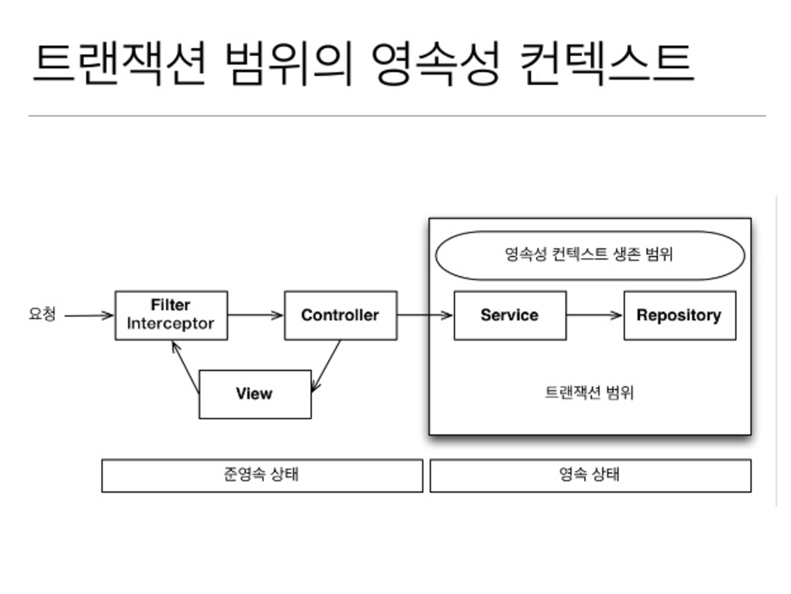
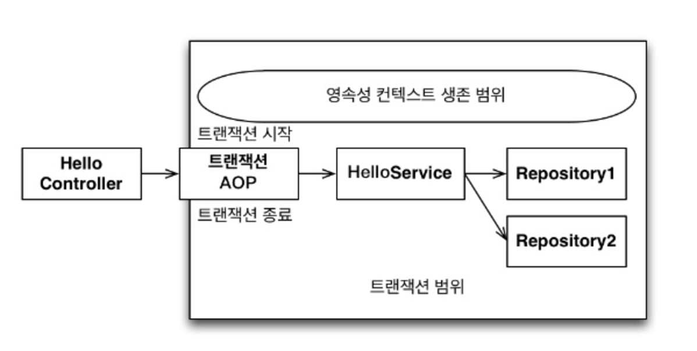
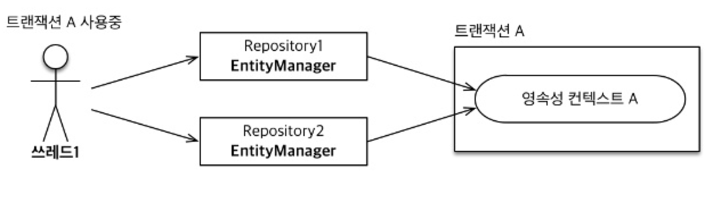
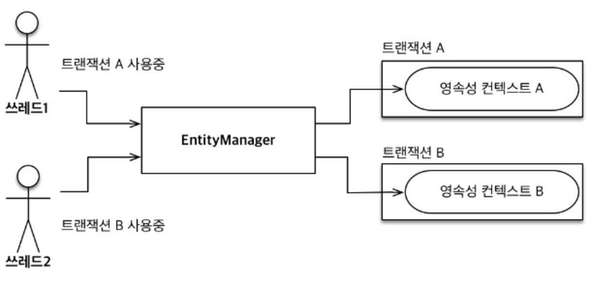
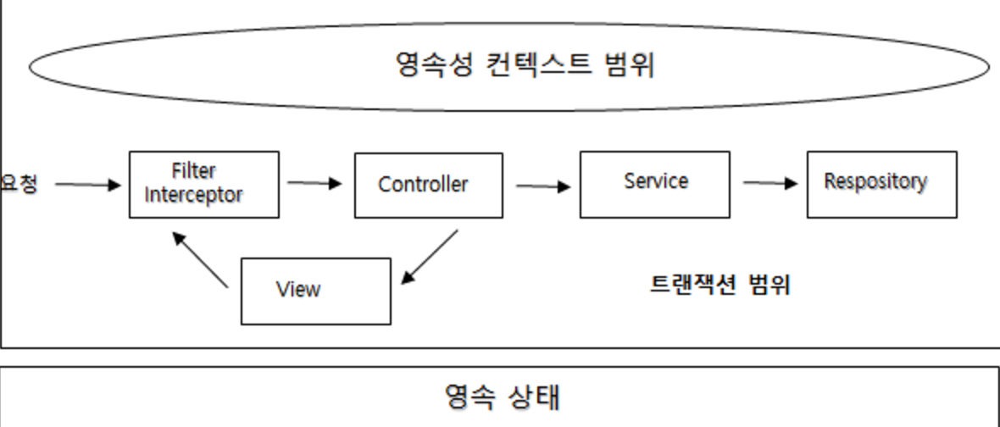
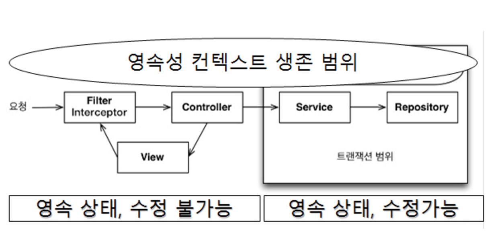

# 13장. 웹 애플리케이션과 영속성 관리

## Overview
- 스프링이나 J2EE 컨테이너 환경에서 JPA를 사용하면 컨테이너가 트랜잭션과 영속성 컨텍스트를 관리해주므로 애플리케이션을 손쉽게 개발할 수 있다.
- 컨테이너 환경에서 JPA가 동작하는 내부 동작 방식을 이해하고, 컨테이너 환경에서 웹 애플리케이션을 개발할 때 발생할 수 있는 다양한 문제점과 해결 방안을 알아보자.

## 13.1 트랜잭션 범위의 영속성 컨텍스트
### 13.1.1 스프링 컨테이너의 기본전략
- 스프링 컨테이너는 트랜잭션 범위의 영속성 컨텍스트 전략을 기본으로 사용한다.
- 이 전략은 트랜잭션을 시작할 때 영속성 컨텍스트를 생성하고 트랜잭션이 끝날 때 영속성 컨텍스트를 종료한다. 그리고 같은 트랜택션 안에서는 항상 같은 영속성 컨텍스트에 접근한다.


- 스피링 프레임워크를 사용하면 보통 비즈니스 로직을 시작하는 서비스 계층에 @Transactional 어노테이션을 선언해서 트랜잭션을 시작한다. 외부에서는 단순히 서비스 계층의 메소드를 호출하는 것처럼 보이지만 이 어노테이션이 있으면 호출한 메소드를 실행하기 직전에 스프링 트랜잭션 AOP가 먼저 동작하낟.


- 트렌잭션이 같으면 같은 영속성 컨텍스트를 사용한다.
    - 트랜잭션 범위의 영속성 컨텍스트 전략은 다양한 위치에서 엔티티 매니저를 주입받아 사용해도 트랜잭션이 같으면 항상 같은 영속성 컨텍스트를 사용한다.
    - 따라서 엔티티 매니저는 달라도 같은 영속성 컨텍스트를 사용한다.


- 트랜잭션이 다르면 다른 영속성 컨텍스트를 사용한다.
    - 여러 스레트에서 동시에 요청이 와서 같은 엔티티 매니저를 사용해도 트랜잭션에 따라 접근하는 영속성 컨텍스트가 다르다. 스프링 컨테이너는 스레드마다 각각 다른 트랜잭션을 할당한다.
    - 따라서 같은 엔티티 매니저를 호출해도 접근하는 영속성 컨텍스트가 다르므로 멀티스레드 상황에 안전하다.


- 스피링이나 J2EE컨테이너의 가장 큰 장점은 트랜잭션과 복잡한 멀티 스레드 상황을 컨테이너가 처리해준다는 점이다. 따라서 개발자는 싱글 스레드 애플리케이션처럼 단순하게 개발할 수 있고 결과적으로 비즈니스 로직 개발에 집중할 수 있다.

## 13.2 준영속 상태와 지연로딩
- 스프링이나 J2EE 컨테이너는 트랜잭션 범위의 영속성 컨텍스트 전략을 기본으로 사용한다.
- 트랜잭션은 보통 서비스 계층에서 시작하므로 서비스 계층이 끝나는 시점에 트랜젝션이 종료되면서 영속성 컨텍스트도 함께 종료된다.
- 조회한 엔티티가 서비스와 리포지토리 계층에서는 영속성 컨텍스트에 관리되면서 영속상태를 유지하지만 컨트롤러나 뷰 같은 프리젝테이션 계층에서는 준영속 상태가 된다.
- 따라서 트랜잭션이 없는 프리젠테이션 계층에서 엔티티는 준영속 상태이므로 지연로딩이 동작하지 않고 지연로딩 시점에 예외가 발생한다.

##### 준영속 상태와 변경 감지
- 비즈니스 로직은 서비스 계층에서 끝ㄴ내고 프리젠테이션 계층은 데이터를 보여주는 데 집중해야 한다.
- 따라서 변경 감지 기능이 프리젠테이션 계층에서 동작하지 않는 것은 특별히 문제가되지 않는다.

##### 준영속 상태와 지연 로딩
- 준영속 상태의 가장 골치 아픈 문제는 지연로딩 기능이 동작하지 않는다는 점이다.
- 아직 초기화하지 않은 프록시 객체를 사용하면 실제 데이터를 불러오려고 초기화를 시도하지만 준영속 상태는 영속성 컨텍스트가 없으므로 지연 로딩을 할 수 없기 때문에 문제가 발생한다.
- 하이버네이트를 구현체로 사용하면 org.hibernate.LazyInitializationException 예외가 발생한다.

##### 준영속 상태의 지연로딩 문제를 해결하는 방법
- 뷰가 필요한 엔티티를 미리 로딩해두는 방법
    - 영속성 컨텍스트가 살아 있을 때 뷰에 필요한 에티티들을 미리 다 로딩하거나 초기화해서 반환하는 방법이다.
    - 뷰가 필요한 엔티티를 미리 로딩해두는 방법은 어디서 미리 로딩하느냐에 따라 3가지 방법이 있다. (글로벌 페이 전략 수정, JPQL 페치 조인, 강제로 초기화)
- OSIV를 사용해서 엔티티를 항상 영속 상태로 유지하는 방법
    - OSIV를 사용하는 방법은 13.3절에서 알아 보자

##### 참고
- 준영속 상태에서 지연 로딩을 시도하면 문제가 발생한다. 하지만 JPA 표준에 어떤 문제가 발생하는지 정의하지 않아서 구현체마다 다르게 동작한다.

### 13.2.1 글로벌 페치 전략 수정
- 글로벌 페치 전략을 지연 로딩에서 즉시 로딩으로 변경한면 된다.

##### 글로벌 페치 전략을 즉시로딩으로 사용 시 단점
- 사용하지 않는 엔티티를 로딩한다.
- N+1 문제가 발생한다.
    - 조회할 때 연관된 엔티티를 로딩하는 전략이 즉시로딩이면 데이터베이스에 JOIN 쿼리를 사용해서 한 번에 연관된 엔티티까지 조회한다.
    - 여기서 문제는 JPQL을 사용할 떄 발생한다. JPA가 JPQL을 분석해서 SQL을 생성할 때는 글로벌 페치 전략을 참고하지 않고 오직 JPQL 쿼리 자체만 사용한다.
    - 즉, JPQL 쿼리 수행 후 즉시로딩 전략을 사용하므로 연관된 엔티티가 즉시 로딩되므로 처음 조회한 데이터 수만큼 다시 SQL을 사용해서 조회하는 하게 된다. 이것을 `N+1`문제라고 한다.
    - N+1문제는 JPQL 페치 조인으로 해결할 수 있다.

### 13.2.2 JPQL 페치 조인
- 글로벌 페치 전략을 즉시 로딩으로 설정하면 애플리케이션 전체에 영향을 주므로 너무 비효율적이다
- JPQL을 호출하는 시점에 함께 로딩할 엔티티를 선택할 수 있는 페치조인을 사용하면 된다.
- 페치조인은 조인 마지막에 fetch를 넣어주면 된다.
- 페치 조인을 사용하면 SQL JOIN을 사용해서 페치 조인 대상까지 함께 조회한다. 따라서 N+1 문제가 발생하지 않는다.

##### JPQL 페치 조인의 단점
- 페치 조인을 무분별하게 사용하면 화면에 맞춘 리포지토리 메소드가 증가할 수 있다.
- 결국 프리젝테이션 계층이 알게 모르게 데이터 접근 계층을 침범하는 것이다.
- 화면에 따라 메소드를 각각 만들면 최적화 할 수 있지만 뷰와 리포지토리 간의 놀리적인 의존관계가 발생한다.
- 페치 조인을 사용하는 메소드를 하나 만들고 모든 화면에서 사용하도록 하면 연관된 엔티티가 필요없는 화면에서도 연관된 엔티티를 로딩하게 되고 약간의 로딩시간이 증가하게 된다.
- 상황에 따라 다르긴 하지만 페치조인은 JOIN을 사용해서 쿼리 한번으로 필요한 데이터를 조회하므로 성능에 미치는 영향은 미비하다.
- 무분별한 최적화로 프리젠테이션 계층과 데이터 접근 계층간에 의존관계가 급격히 증가하는 것보다는 적절한 선에서 타협점을 찾는 것이 합리적이다.

### 13.2.3 강제로 초기화
- 강제로 초기화하기는 영속성 컨텍스트가 살아있을 때 프리젝테이션 계층이 필요한 엔티티를 강제로 초기화해서 반환하는 방법이다.
-  글로벌 페치 전략을 지연로딩으로 설정하면 연관된 엔티티를 실제 엔티티가 아닌 프록시 객체로 조회한다. 프록시 객체는 실제 사용하는 시점에 초기화된다.
- 하이버네이트를 사용하면 initialize() 메소드를 사용해서 프록시를 강제로 초기화할 수 있다. 참고로 JPA 표춘에는 프록시 초기화 메소드가 없다. 단지 초기화 여부만 확인 할 수 있다.
- <span style="color:#0052cc">프록시를 초기화 하는 역활은 서비스 계층이 담당하면 뷰가 필요한 엔티티에 따라 서비스 계층의 로직을 변경해야 한다. 프리젠테이션 계층이 서비스 계층을 침범하는 상황이다.</span>
- 서비스 계층은 비즈니스 로직을 담당해야지 프리젠테이션 계층을 위한 일까지 하는 것은 좋지않다. 따라서 프록시 초기화 역화을 비즈니스 계층에서 분리해야한다. FACADE 계층이 그 역확을 담담해 줄 수 있다.

### 13.2.4 FACADE 계층 추가
- 이제부터 뷰를 위한 프록시 초기화는 이곳에서 담당한다.
- 덕분에 서비스 계층느 프리젝테이션 계층을 위해 프록시를 초기화 하지 않아도 된다.
- 결과적으로 FACADE 계츨을 도입해서 서비스 계층과 프리젝테이션 계층 사이에 논리적인 의존성을 분리할 수 있다.
- 하지만 실용적인 관점에서 볼 때 FACADE의 최대 단점은 중간에 계층이 하나 더 끼어든다는 점이다. 결국 더많은 코드를 작성해야 한다. 그리고 FACADE에는 단순히 서비스 계층을 호출하는 위임 코드가 상당히 많은 것이다.

### 13.2.5 준영속 상태와 지연 로딩의 문제점
- 뷰를 개발할 때 필요한 엔티티르 미리 초기화하는 방법은 생각보다 오류가 발생할 가능성이 높다.
- 결국 영속성 컨텍스트가 없는 뷰에서 초기화하지 않은 프록시 엔티티를 조회하는 실수를 하게 되고 LazyInitializationException을 만나게 될 것이다.
- <span style="color:#0052cc">결국 모든 문제는 엔티티가 프리젝테이션 계층에서 준영속 상태이기 때문에 발생한다. 영속성 컨텍스트를 뷰까지 살아있게 열어두자. 그럼 뷰에서도 지연로딩을 할 수 있는데 이것이 OSIV다.</span>

## 13.3 OSIV
- OSIV(Open Session In View)는 영속성 컨텍스트 뷰까지 열어둔다는 뜻이다.
- 영속성 컨텍스트가 살아있으면 엔티티는 영속 상태로 유지된다. 따라서 뷰에서도 지연로딩을 사용할 수 있다.

##### 참고
- OSIV는 하이버테이트에서 사용하는 용어다. JPA에서는 OEIV(Open EntityManager In View)라 한다. 하지만 관례상 모두 OSIV라고 부른다.

### 13.3.1 과거 OSIV: 요청 당 트랜잭션
- OSIV의 핵심은 뷰에서도 지연 로딩이 가능하도록 하는 것이다.
- 가장 단순한 구현 방법은 클라이언트의 요청이 들어오자마자 서블릿 필터나 스프링 인터셉터에서 트랜잭션을 시작하고 요청이 끝날 때 트랜잭션도 끝내는 것이다.
- 이것을 트랜잭션(Transaction per request)방식의 OSIV라 한다.


##### 요청 당 트랜잭션 방식의 OSIV 문제점
- 요청 당 트랜잭션 방식의 OSIV가 가지는 문제점은 컨트롤러나 뷰 같은 프리젠테이션 계층이 엔티티를 변경할 수 ㅇ씨다는 점이다.
- 보안상의 이유로 고객 이름을 XXX로 변경해서 출력해야 한다고 하면 데이터베이스에 있는 고객이름까지 변경되는 심각한 문제가 발생한다.
- 이런 문제를 해결할려면 프리젠테이션 계층에서 엔티티를 수정하지 못하게 막으면 된다.
    - 엔티티를 읽기 전용 인터페이스로 제공
    - 엔티티 레핑
    - DTO만 반환
- 위 3가지 방식 모두 코드량이 상당히 증가한다는 단점이 있다.
- 최근에는 이런 문제점을 어느정도 보완해서 비즈니스 계층에서만 트랜잭션을 유지하는 방식의 OSIV를 사용한다.
- 스프링 프레임워크가 제공하는 OSIV가 바로 이 방식을 사용하는 OSIV다.

### 13.3.2 스프링 OSIV: 비즈니스 계층 트랜잭션
##### 스프링 프레임워크가 제공하는 OSIV 라이브러리
- 스프링 프레임워크의 sping-orm.jar는 다양한 OSIV 클래스를 제공한다. OSIV를 서블릿 필터에서 적용할지 스프링 인터셉터에서 적용할지에 따라 원하는 클래스를 선택해서 사용하면 된다.
    - 하이버네이트 OSIV 서블릿 필터: org.springframework.orm.hibernate4.support.OpenSessionInViewFilter
    - 하이버네이트 OSIV 스프링 인터셉터: org.springframework.orm.hibernate4.OpenSessionInViewInterceptor
    - JPA OEIV 서블릿 필터: org.springframework.orm.jpa.support.OpenEntityManagerInViewFilter
    - JPA OEIV 스프링 인터셉터: org.springframework.orm.jpa.support.OpenEntityManagerInViewInterceptor


```xml
<mvc:interceptors>
  <mvc:interceptor>
    <mvc:mapping path="/**" />
    <bean
class="org.springframework.orm.jpa.support.OpenEntityManagerInViewInterceptor"
    />
  </mvc:interceptor>
</mvc:interceptors>
```

##### 스프링 OSIV 분석
- 스프링 프레임워크가 제공하는 OSIV는 비지니스 계층에서만 트랜잭션을 사용하는 OSIV이다.

1. 클라이언트의 요청이 들어오면 서블릿 필터나, 스프링 인터셉터에서 영속성 컨텍스트를 생성한다. 단 이때 트랜잭션은 시작하지는 않는다.
2. 서비스 계층에서 @Transactional로 트랜잭션을 시작할 때 1번에서 미리 생성해둔 영속성 컨텍스트를 찾아와서 트랜잭션을 시작한다.
3. 서비스 계층이 끝나면 트랜잭션을 커밋하고 영속성 컨텍스트를 플러시 한다. 이때 트랜잭션은 끝내지만 영속성 컨텍스트는 종료하지 않는다.
4. 컨트롤러와 뷰까지 영속성 컨텍스트가 유지되므로 조회한 엔티티는 영속 상태를 유지한다.
5. 서블릿 필터나, 스프링 인터셉터로 요청이 돌아오면 영속성 컨텍스트를 종료한다. 이때 프러시를 호출하지 않고 바로 종료한다.

##### 트랜잭션 없이 읽기
- 영속성 컨텍스트는 트랜잭션 범위 안에서 엔티티를 조회하고 수정할 수 있다.
- 영속성 컨텍스트는 트랜잭션 범위 밖에서 엔티티를 조회만 할 수 있다. 이것을 트랜택션 없이 읽기(Nontransactional reads)라 한다.

특징
- 영속성 컨텍스트를 프리젠테이션 계층까지 유지한다.
- 프리젝테이션 계층에는 트랜잭션이 없으므로 엔티티를 수정할 수 없다.
- 프리젠테이션 계층에는 트랜잭션이 없지만 트랜잭션 없이 읽기를 사용해서 지연로딩을 할 수 있다.

프리젠테이션 계층에서 플러시가 동작하지 않는 이유
- 트랜잭션을 사용하는 서비스 계층이 끝날 때 트랜잭션이 커밋되면서 이미 플러시해버렸다. 그리고 스프링이 제공하는 OSIV 서블릿 필터나 OSIV 스프링 인터셉터는 요청이 끝나면 플러시를 호출하지 않고 영속성 컨텍스트만 종료해 버리므로 플러시가 일어나지 않는다.
- 프리젝테이션 계층에서 강제로 플러시해도 트랜잭션 범위 밖이므로 데이터를 수정할 수 없다는 예외를 만난다.
- 따라서 프리젠테이션 계층에서 영속 상태의 엔티티를 수정해도 수정 내용이 데이터베이스에는 반영되지 않는다.

##### 스프링 OSIV 주의사항
- 프리젠테이션 계층에서 엔티티를 수정한 직후에 트랜잭션을 시작하는 서비스 계층을 호출하면 문제가 발생한다.
- 문제를 해결하는 단순한 방법은 트랜젝션이 있는 비즈니스 로직을 모두 호출하고 나서 엔티티를 변경하면 된다.
- 스프링 OSIV는 같은 영속성 컨텍스트를 여러 트랜잭션이 공유할 수 있으므로 이런 문제가 발생한다. OSIV를 사용하지 않는 트랜잭션 범위의 영속성 컨텍스트 전략은 트랜잭션의 생명주기와 영속성 컨텍스트의 생명주기가 같으므로 이런 문제가 발생하지 않는다.

### 13.3.3 OSIV 정리
- 스프링 OSIV의 특징
    - OSIV는 클라이언트의 요청이 들어올 때 영속성 컨텍스트를 생성해서 요청이 끝날 때까지 같은 영속성 컨텍스트를 유지한다.
    - 엔티티 수정은 트랜잭션이 있는 계층에서만 동작한다. 트랜잭션이 없는 프리젠테이션 계층은 지연로딩을 포함해서 조회만 할 수 있다.

- 스프링 OSIV의 단점
    - OSIV를 적용하면 같은 영속성 컨텍스트를 여러 트랜잭션이 공유할 수 있다는 점을 주의해야 한다. 특히 트랜잭션 롤백 시 주의해야 하는데 15.1.4절을 참고하자.
    - 프리젠테이션 계층에서 엔티티를 수정하고나서 비즈니스 로직을 수행하면 엔티티가 수정될 수 있다.
    - 프리젠테이션 계층에서 지연 로딩에 의한 SQL이 실행된다. 따라서 성능 튜닝시에 확인해야 할 부분이 넓다.

- OSIV vs FACADE vs DTO
    - 어떤 방법을 사용하든 결국 준영속 상태가 되기 전에 프록시를 초기화하거나 엔티티를 직접 노출하지 않고 엔티티와 비슷한  DTO를 만들어 반환하는 것이다.
    - 어떤 방법이든 OSIV를 사용하는 것과 비교해서 지루한 코드를 많이 작성해야 한다.

- OSIV를 사용하는 방법이 만능은 아니다.
    - 복잡한 통계화면은 엔티티를 조회하기보다는 처음부터 통계 데이터를 구성하기 위한 JPQL을 작성해서 DTO로 조회하는 것이 효과적이다.
    - 그리고 수많은 테이블을 조인해서 보여주어야 하는 복잡한 관리자 화면도 객체 그래프로 표현하기 어려운 경우가 많다. 이때도 직접 조회하기보다는 JPQL로 필요한 데이터들만 조회해서 DTO로 반환하는 것이 더 나은 해결책일 수 있다.

- OSIV는 같은 JVM을 벗어난 원격 상황에서는 사용할 수 없다.
    - 원격지인 클라이언트에서 연관된 엔티티를 지연 로딩하는 것은 불가능하다.
    - 결국 클라이언트가 필요한 데이터를 모두 JSON으로 생성해서 반환해야 한다.
    - 보통 Jackson이나 Gson 같은 라이브러리를 사용해서 객체를 JSON으로 변환하는데, 변환 대상 객체로 엔티티를 직접 노출하거나 또는 DTO를 사용해서 노출한다.
    - 이렇게 JSON으로 생성한 API는 한 번 정의하면 수정하기 어려운 외부 API와 언제든지 수정할 수 있는 내부 API로 나눌 수 있다.
        - 외부 API: 외부에 노출한다. 한 번 정의하면 변경이 어렵다. 서버와 클라이언트를 동시에 수정하기 어렵다.
        - 내부 API: 외부에 노출하지 않는다. 언제든지 변경할 수 있다. 서버와 클라이언트를 동시에 수정할 수 있다.

## 13.4 너무 엄격한 계층
- OSIV를 사용하면 영속성 컨텍스트가 프리젠테이션 계층까지 살아있으므로 미리 초기화할 필요가 없다. 따라서 단순한 엔티티 조회는 컨트롤러에서 리포지토리를 직접 호출해도 아무런 문제가 없다.
- OSIV를 사용하면 설명한 것처럼 좀 더 유연하고 실용적인 관점으로 접근하는 것도 좋은 방법이라고 생각한다.

## 13.5 정리
- 스프링이나 J2EE 컨테이너 환경에서 JPA를 사용하면 트랜잭션 범위의 영속성 컨텍스트 전략이 적용된다.
- 이 전략은 트랜잭션의 범위와 영속성 컨텍스트의 생존 범위가 같다. 그리고 같은 트랜잭션 안에서는 항상 같은 영속성 컨텍스트에 접근한다.
- 이 전략은 트랜잭셩이라는 단위로 영속성 컨텍스트를 관리하므로 트랜잭션을 커밋하거나 롤백할 때 문제가 없다.
- 이 전략의 유일한 단점은 프리젝테이션 계층에서 엔티티가 준영속 상태가 되므로 지연 로딩을 할 수 없다는 점이다.
- OSIV를 사용하면 이런 문제들을 해결할 수 있다.
- 기존 OSIV는 프리젝테이션 계층에서도 엔티티를 수정할수 있다는 단점이 있었다.
- 스프링 프레임워크가 제공하는 OSIV는 기존 OSIV의 단점들을해결해서 프리젠테이션 계층에서 엔티티를 수정하지 않는다.