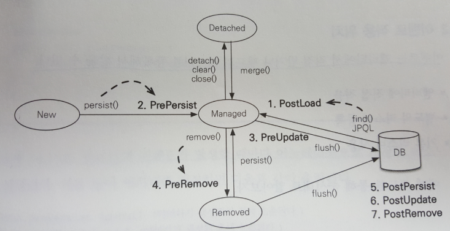

# 14장. 컬렉션과 부가 기능

## 14.1 컬렉션
### 14.1.1 JPA와 컬렉션
* hibernate는 컬렉션을 효율적으로 관리하기 위해, 엔티티를 영속 상태로 만들 때, 원본 컬렉션을 감싸고 있는 내장 컬렉션을 생성해서 이 내장 컬렉션을 사용하도록 참조를 변경함 (=> 레퍼 클래스)

컬렉션 | 내장 컬렉션 | 비고
-- | -- | --
Collection, List | PersistenceBag | 엔티티를 추가해도 지연 로딩된 컬렉션을 초기화하지 않음
Set | PersistenceSet | 엔티티를 추가할 때 중복된 엔티티가 있는지 비교해야 하므로, 지연 로딩된 컬렉션을 초기화홤
List + @OrderColumn | PersistenceList | 순서가 있는 컬렉션은 DB에 순서 값도 함께 관리함, @OrderColumn은 실무에서 잘 사용하지 않음
List + @OrderBy | PersistenceList | @Orderby는 DB의 order by를 사용, 엔티티의 필드 대상

## 14.2 @Converter
* 컨버터를 사용하면 엔티티의 데이터를 변환해서 DB에 저장할 수 있음
* application의 boolean 타입을 DB에는 Y, N과 같은 char(1)로 저장하고 싶을 경우

```
@Entity
public class Member {
    ....
    @Convert(converter = BooleanToYNConverter.class)
    private boolean vip;
}
```

```
// 모든 Boolean 타입에 컨버터를 적용하려면, autoApply 속성 true 설정
@Converter(autoApply = true)
public class BooleanToYNConverter implements AttributeConverter<Boolean, String> {
    @Override
    public String convertToDatabaseColumn(Boolean attribute) {
        return (attribute != null && attribute) ? "Y" : "N";
    }
    @Override
    public String convertToEntityAttribuate(String dbData) {
        return "Y".equals(dbData);
    }
}
```

* @Convert 속성

속성 | 기능
-- | --
converter | 사용할 컨버터 지정
attributeName | 컨버터를 적용할 필드 지정
disableConversion | 글로번 컨버터나 상속 받은 컨버터를 사용하지 않음

## 14.3 리스너
* 엔티티의 생명주기에  따른 이벤트 처리 가능
* 리스너를 잘 활용하면, audit log를 효과적으로 남길 수 있음

### 14.3.1 이벤트 종류

1. PostLoad
    * 엔티티가 영속성 컨텍스트를 조회된 직후 또는 refresh를 호출한 후
2. PrePersist
    * 메소드를 호출해서 엔티티를 영속성 컨텍스트에 관라히기 직전에 호출 또는 새로운 인스턴스를 merge 할 때
3. PreUpdate
    * flush나 commit 호출해서 엔티티를 DB에 수정하기 직적에 호출
4. PreRemove
    * remove() 메소드를 호출해서 엔티티를 영속성 컨테스트에서 삭제하기 직전에 호출 또는 영속성 전이가 일어날 때
    * orphanRemoval은 flush나 commit시에 호출
5. PostPersist
    * flush나 commit 호출해서 엔티티를 DB에 저장한 직후에 호출
    * 식별자 생성 전략 IDENTITY면 persist() 호출 직후, 바로 호출됨
6. PostUpdate
    * flush나 commit 호출해서 엔티티를 DB에 수정한 직후에 호출
7. PostRemove
    * flush나 commit 호출해서 엔티티를 DB에 삭제한 직후에 호출

### 14.3.2 이벤트 적용 위치
* 엔티티에 직접 적용
    * 엔티티에 이벤트가 발생할 때마다 어노테이션으로 지정한 메소드 실행
        * @PrePersist
        * @PostPersist
        * @PostLoad
        * ....
* 별도의 리스너 등록
    * 리스너는 대상 엔티티를 파라미터로 받을 수 있음
        ```java
        @Entity
        @EntityListners(DuckListener.class)
        public class Duck {}
        
        public class DuckListener {
            @PrePersist
            private void prePersist(Object obj) {
                ...
            }
        }
        ```
    * 반환 타입은 void로 설정해야함
* 기본 리스너 사용
    * 모든 엔티티의 이벤트를 처리하려면 META-INF/orm.xml에 기본 리스너 등록
    ```xml
    <?xml version = "1.0" encoding="UTF-8"?>
    <entity-mappings ...>
        <persistence-unit-metadata>
            <persistence-unit-defaults>
                <entity-listeners>            
                    <entity-listener class="com.nhnent.pflat.listener.DefaultListener" />
                </entity-listeners>
            </persistence-unit-defaults>
        </persistence-unit-metadata>
    </entity-mappings>
    ```
* 여러 리스너 등록 시 호출 순서
    1. 기본 리스너
    2. 부모 클래스 리스너
    3. 리스너
    4. 엔티티

## 14.4 엔티티 그래프
* 엔티티 조회할 때 연관된 엔티티 함께 조회할 방법
    * 글로벌 fetch 옵션 = FetchType.EAGER 설정
        * application 전체에 영향을 주므로, 일반적으로는 FetchType.LAZY를 사용하고, 즉시 조회 필요시 JPQL의 페치 조인 사용
    * JPQL에서 페치 조인 사용
        * JPQL을 중복해서 작성하는 경우가 많음
            * 주문만 조회하는 jpql
            * 주문과 회원을 조회하는 jpql
            * 주문과 주문상세내역을 조회하는 jpql
    * ```엔티티 그래프 기능```
        * JPA 2.1에 추가
        * 엔티티 조회 시점에 연관된 엔티티들을 함께 조회하는 기능

## 14.4.1 Named 엔티티 그래프
* @NameEntityGraph로 정의
    * name
        * 엔티티 그래프 이름 정의
    * attributeNodes
        * 함께 조회할 속성 선택

```java
@NamedEntityGraph(name = "Order.withMember", attributeNodes = {
    @NamedAttributeNode("member")    
})
@Entity
public class Order { 
    @ManyToOne(fetch = FetchType.Lazy, optional = false)
    @JosinColumn(name = "MEMBER_ID")
    private Member member;
}
```

## 14.4.2 em.find()에서 엔티티 그래프 사용
* jpa의 힌트 키로 javax.persistence.fetchgraph를사용하고, 힌트의 값으로 찾아온 엔티티 그래프 사용
```
EntityGraph graph = em.getEntityGraph("Order.withMember");

Map hists = new HashMap();
hints.put("javax.persistence.fetchgraph", graph);

Order order = em.find(Order.class, orderId, hints);
```

## 14.4.3 subgraph
* 가령, Order -> OrderItem -> Item 함께 조회
    * Orer는 OrderItem을 관리하지만 ,Item은 관리하는 필드가 아님
    * @NamedSubgraph 사용해서 서브 그래프 정의

```java
@NamedEntityGraph(name = "Order.withAll", attributeNodes = {
        @NamedAttributeNode("member"),
        @NamedAttributeNode(value = "orderItems", subgraph = "orderItems")
    }, subgraphs = @NamedSugraph(name = "orderItems", attributeNodes = {
        @NamedAttributeNode("item")
    })
)
@Entity
public class Order { ... }
```

## 14.4.4 JPQL에서 엔티티 그래프 사용
* em.find()와 동일하게 힌트만 추가

```
List<Order> resultList = em.createQuery("select o from Order o where o.id = :orderId", Order.class)
                                                                .setParameter("orderId", orderId)
                                                                .setHint("javax.persistence.fetchgraph", em.getEntityGraph("Order.withAll"))
                                                                .getReulstList();
```

* em.find()는 sql 내부조인 사용
* JPQL은 항상 sql 외부조인 사용

## 14.4.5 동적 엔티티 그래프
* 엔티티 그래프를 동적으로 구성하려면 createEntityGraph() 메소드 사용
```java
EntityGraph<Order> graph = em.createEntityGraph(Order.class);
 graph.addAttributeNodes("member");
    
Map hints = new...
```

## 14.4.6 엔티티 그래프 정리
* ROOT에서 시작
    * 엔티티 그래프는 항상 조회하는 엔티티의 ROOT에서 시작해야 함
* 이미 로딩된 엔티티
    * 영속성 컨텍스트에 해당 엔티티가 이미 로딩되어 있으면, 엔티티 그래프가 적용되지 않음 (처음에 조회한 instance 반환)
* fetchgraph, loadgraph 차이
    * javax.persistence.fetchgraph
        * fetchgraph는 엔티티 그래프에 선택한 속성만 함께 조회
    * javax.persistence.loadgraph        
        * loadgraph는 속성 뿐아니라, 글로벌 fetch 모드가 FetchType.EAGER로 설정된 연관관계도 포함해서 조회