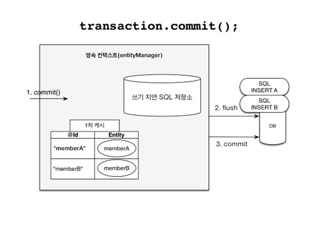

# 3장.영속성 관리
## 엔티티 매니저

엔티티를 저장하고, 수정하고, 삭제하고, 조회하는 등 엔티티와 관련된 모든 일을 처리한다. 이름 그대로 엔티티를 관리하는 관리자다.

## 3.1 엔티티 매니저 팩토리와 엔티티 메니저

* 엔티티 매니저 팩토리
    * 엔티티 매니저를 만드는 공장으로 엔티티 매니저 팩토리를 만드는 비용은 상당히 크다.
    * 엔티티 매니저 팩토리는 여러 스레드가 동시에 접근해도 안전하므로 서로 다른 스레드 간에 공유가 가능하다
* 엔티티 매니저
    * 엔티티 매니저를 생성하는 비용은 거의 들지 않는다.
    * 엔티티 매니저는 여러 스레드가 동시에 접근하면 동시성 문제가 발생하므로 스레드간에 절대 공유하면 안된다.

## 3.2 영속성 컨텍스트란?

* 엔티티를 영구 저장하는 환경이라는 뜻이다.
* `em.persist(member)`는 엔티티 매니저를 사용해서 회원 엔티티를 영속성 컨텍스트에 저장한다.
* 영속성 켄텍스트는 엔티티 매니저를 생산할 때 하나 만들어 지며, 엔티티 매지너를 통해서 접근, 관리할 수 있다.
* 참고) 여러 엔티티 메니저가 같은 영속성 컨텍스트에 접근할 수도 있다. (11장에서 설명)

## 3.3 엔티티의 생명주기

* 비영속 (new/transient)
    * 엔티티 객체를 생성
    * 영속성 컨텍스트나 데이터베이스와는 전혀 관련이 없는 상태
* 영속 (managed)
    * 엔티티 매니저를 통해서 엔티티를 영속성 컨텍스트에 저장
    * 영속성 컨텍스트가 관리하는 엔티티를 영속 상태하고 하며, 영속성 컨텍스트에 의해 관리된다는 뜻이다.
    * `em.find()`나 JPQL을 사용해서 조회한 엔티티도 영속성 컨텍스트가 관리하는 영속 상태이다.
* 준영속 (detached)
    * 영속 상태 엔티티를 영속성 컨텍스트가 관리하지 않으면 준영속 상태가 된다.
    * `em.detach()` 또는 `em.close()` 또는 `em.clear()`를 호출하면 준영속 상태가 된다.
* 삭제 (removed)
    * `em.detach(member)`를 호출하여 엔티티를 영송성 컨텍스트와 데이터베이스에서 삭제한다.

## 3.4 영속성 컨텍스트의 특징

* 영속성 컨텍스트와 식별자 값
    * 영속성 컨텍스트는 엔티티를 식별자 값(@Id)으로 구분
    * 영속 상태는 반드시 식별자 값이 있다.
* 영속성 컥텍스트와 데이터베이스 저장
    * JPA는 보통 트랜잭션을 커밋하는 순간 영속성 컨텍스트에 새로 저장된 엔티티를 데이터베이스에 반영하는데 이것을 플러시(flush)라 한다.
* 영속성 컨텍스트가 엔티티를 관리하면 다음과 같은 장점이 있다
    * 1차 캐시
    * 동일성 보장
    * 트랜잭션을 지원하는 쓰기 지연
    * 변경 감지
    * 지연 로딩

### 3.4.1 엔티티 조회

* 영속성 컨텍스트는 내부에 1차 캐시를 가지고 있고, 영속 상태의 엔티티는 모두 이곳에 저장된다.
* `em.find()`를 호출하면 1차 캐시에서 엔티티를 찾고 없으면 데이터베이스에서 조회해서 엔티티를 생성한다. 그리고 1차 캐시에 저장한 후에 영속 상태의 엔티티를 반환한다.
* 영속성 컨텍스트는 1차 캐시에 있는 같은 엔티티 인스턴스를 반환한다. 따라서 영속성 컨텍스트는 성능상 이점과 엔티티의 동일성을 보장한다.
* 참고) JPA는 1차 캐시를 통해 반복 가능한 읽기(REPEATABLE READ) 등급의 트랜잭션 격리 수준을 데이터베이스가 아닌 애플리케이션 차원에서 제공한다는 장점이 있다.

### 3.4.2 엔티티 등록

* 트랜잭션을 지원하는 쓰기지연(transactional write-behind)
    * 엔티티 매니저는 트랜잭션을 커밋하기 직전까지 내부 쿼리 저장소에 INSERT SQL을 모았다가 커밋할 때 데이터베이스에 보내는 것을 의미한다.
* 트랜잭션을 커밋 하면 엔티티 매니저는 우선 영속성 컨텍스트를 플러시 한다. 플러시는 영속성 컨텍스트의 변경 내용을 데이터베이스에 동기화하는 작업인데 이때 등록, 수정, 삭제한 엔티티를 데이터베이스에 반영한다. (쓰기지연 SQL 저장소에 모인 쿼리를 데이터베이스로 전송) 
* 트랜잭션을 지원하는 쓰기지연이 가능한 이유
    * 등록 쿼리를 바로 데이터베이스에 전달해도 트랜잭션을 커밋하지 않으면 아무 소용이 없다. 어떻게든 커밋 직전에만 데이터베이스에 SQL을 전달하면 된다.

### 3.4.3 엔티티 수정

* 변경감지(dirty checking)
    * 엔티티의 변경사항을 데이터베이스에 자동으로 반영하는 기능
    * JPA는 엔티티를 영속성 컨텍스트에 보관할 때, 최초 상태를 복사해서 저장해두는데 이것을 스냅샷이라고 한다. 그리고 플러시 시점에 스냅샷과 엔티티를 비교해서 변경된 엔티티를 찾는다.
    * 변경 감지는 영속성 컨텍스트가 관리하는 영속 상태의 엔티티에만 적용된다.
* JPA의 기본 전략은 엔티티의 모든 필드를 업데이트하는 것이다.
    * 단점
        * 데이터베이스에 보내는 데이터 전송량이 증가
    * 장점
        * 수정쿼리가 항상 같으므로 애플리케이션 로딩 시점에 수정 쿼리를 미리 생성해 두고 재사용할 수 있다.
        * 데이터베이스에 동일한 쿼리를 보내면 데이터베이스는 이전에 한 번 파싱된 쿼리를 재사용할 수 있다.
* 동적으로 UPDATE SQL을 생성할 수 있는 하이버네이트 확장 기능
    * org.hibernate.annotations.DynamicUpdate 어노테이션 (@DynamicUpdate)
        * 수정된 데이터만 사용해서 동적으로 UPDATE SQL 생성
    * @DynamicInsert
        * 데이터가 존재하는(null이 아닌) 필드만으로 INSERT SQL을 동적으로 생성

### 3.4.4 엔티티 삭제

* 엔티티를 즉시 삭제하는 것이 아니라 엔티티 등록과 비슷하게 삭제 쿼리를 쓰기 지연 SQL 저장소에 등록
* 트랜잭션을 커밋해서 플러시를 호출하면 실제 데이터베이스에 삭제 쿼리를 전달
* `em.remove(member)`를 호출하는 순간 영속성 컨텍스트에서는 제거됨

## 3.5 플러시

* 플러시(flush())는 영속성 컨텍스트의 변경 내용을 데이터베이스에 반영한다.
    * FlushModeType.AUTO: 커밋이나 쿼리를 실행할 때 플러시(기본값)
    * FlushModeType.COMMIT: 커밋할 때만 플러시
* 영속성 컨텍스트의 변경내용을 데이터베이스에 동기화하는 것이 플러시다. 그리고 데이터베이스와 동기화를 최대한 늦추는 것이 가능한 이유는 트랜잭션이라는 작업 단위가 있기 때문이다. 트랜잭션 커밋 직전에만 변경 내용을 데이터베이스에 보내 동기화하면 된다.
* 직접호출
    * `em.flush()`를 직접 호출, 테스트나 다른 프레임워크와 JPA를 함께 사용할 때를 제외하고 거의 사용하지 않음
* 트랜잭션 커밋 시 플러시 자동 호출
    * 데이터베이스에 변경 내용을 SQL로 전달해야 함으로 트랜잭션을 커밋하기 전에 꼭 플러시를 호출해야한다.
    * JPA는 이런 문제를 예방하기 위해 트랜잭션을 커밋할 때 플러시를 자동으로 호출한다.
* JPQL 쿼리 실행 시 플러시 자동 호출
    * JPQL 쿼리를 실행하기 전에 영속성 컨텍스트를 플러시해서 변경 내용을 데이터베이스에 반영해야한다.
    * JPA는 이런 문제를 예방하기 위해 JPQL을 실행할 때도 플러시를 자동으로 호출한다.

## 3.6 준영속

* 영속 상태의 엔티티가 영속성 컨텍스트에서 분리된(detached)것을 준영속 상태라 한다.
* 준영속 상태의 엔티티는 영속성 컨텍스트가 제공하는 기능을 사용할 수 없다.

### 3.6.1 엔티티를 준영속 상태로 전환: detach()

* `em.detach()`는 특정 엔티티를 준영속 상태로 만든다. 1차 캐시부터 쓰기 지연 SQL 저장소까지 해단 엔티티를 관리하기 위한 모든 정보가 제거된다.
* 즉, 준영속 상태는 영속성 컨텍스트로부터 분리(detach)된 상태이다.

### 3.6.2 영속성 컨텍스트 초기화: clear()

* `em.clear()`는 영속성 컨텍스트를 초기화해서 해당 영속성 컨텍스트의 모든 엔티티를 준영속 상태로 만든다.

### 3.6.3 영속성 컨텍스트 종료: close()

* `em.close()`는 영속성 컨텍스트를 종료해서 해당 영속성 컨텍스트가 관리하던 영속 상태의 엔티티를 준영속 상태로 만든다.
* 참고) 영속 상태의 엔티티는 주로 영속성 컨텍스트가 종료되면서 준영속 상태가 된다. 개발자가 직접 준영속 상태로 만드는 일은 드물다.

### 3.6.4 준영속 상태의 특징

* 거의 비영속 상태에 가깝다.
* 식별자 값을 가지고 있다.
* 지연로딩을 할 수 없다.
    * 지연로딩(LAZY LOADING)은 실제 객체 대신 프록시 객체를 로딩해두고 해당 객체를 실제 사용할 때 영속성 컨텍스트를 통해 데이터를 불러오는 방법이다. 하지만 준영송 상태는 영속성 컨텍스트가 더는 관리하지 않으므로 지연로딩시 문제가 발생한다.

### 3.6.5 병합: merge()

* `em.merge(member)`는 준영속 상태의 엔티티를 받아서 그 정보로 새로운 영속 상태의 엔티티를 반환한다.
* 준영속 상태의 엔티티를 수정하려면 준영속 상태를 다시 영속 상태로 변경해야 하는데 이때 병합을 사용한다. 정확히는 준영속 상태에서 영속상태로 변경되는 것이 아닌 새로운 영속 상태의 엔티티가 반환된다.
* 병합은 비영속 엔티티도 영속상태로 만들 수 있다.
* 병합은 준영속, 비영속을 신경 쓰지 않는다. 식별자 값으로 엔티티를 조회할 수 있으면 불러서 병합하고 조회할 수 없으면 새로 생성해서 병합한다.
* 즉, 병합은 save or update기능을 수행한다.

## 3.7 정리

* 엔티티 매니전느 엔티티 매니저 팩토리에서 생성한다.
    * 자바를 직접 다루는 J2SE환경에서는 엔티티 매니저를 만들면 그 내부에 영속성 컨텍스트도 함께 만들어 진다.
    * 이 영속성 컨텍스트는 엔티티 매니저를 통해서 접근할 수 있다.
* 영속성 컨텍스트는 애플리케이션과 데이터베이스 사이에서 객체를 보관하는 가상의 데이터베이스 같은 역할을 한다.
    * 영속성 컨텍스트 덕분에 1차 캐시, 동일성 보장, 트랜잭션을 지원하는 쓰기 지연, 변경 감지, 지연 로딩 기능을 사용할 수 있다.