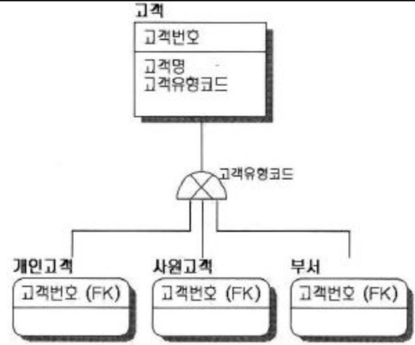

# 7장. 고급매핑

## Overview
* @MappedSuperclass
    * 등록일, 수정일 같이 여러 엔티티에서 공통으로 사용하는 매핑 정보만 상속받고 싶으면 이 기능을 사용.


## 7.1 상송 관계 매핑


* 슈퍼 타입 서브타입 관계는 논리적 모델링 기법이 객체의 상속 개념과 가장 유사
    * 논리모델을 물리 모델인 테이블로 구현할 때..
        * 각각의 테이블로 변환 (조인 전략)
        * 통합 테이블로 변환 (단일 테이블 전략)
        * 서브 타입 테이블로 변환 (구현 클래스마다 테이블 전략)

### 7.1.1 조인 전략

* 조인 전략은 엔티티 각각을 모두 테이블로 만들고 자식 테이블이 부모 테이블의 기본 키를 받아서 기본 키 + 외래 키로 사용하는 전략
* 주의점
    * 객체는 타입으로 구분 가능, 테이블은 타입의 개념이 없음
    * 타입을 구분하는 컬럼을 추가해야 함
        ```java
        @Entity
        @Inheritance(strategy = InheritanceType.JOINED)
        @DiscriminatorColumn(name = "DTYPE")
        public abstract class Item {
            @Id @GeneratedValue
            private Long itemId;
        ```
        * @Inheritance(strategy = InheritanceType.JOINED)
            * 상속 매핑은 부모 클래스에 @Inheritance를 사용해야 함            
        * @DiscriminatorColumn(name = "DTYPE")
            * 부모 클래스에 구분 컬럼을 지정
         
         ```java
        @Entity
        @DiscriminatorValue("A")
        @PrimaryKeyJoinColumn(name = "album_id")    // itemId를 album_id으로 재정의
        public class Album extends Item {
        ```
        * @DiscriminatorValue("A")
            * 엔티티를 저장할 때 구분 컬럼에 입력할 값을 지정
            * 기본값으로 자식 테이블은 부모 테이블의 ID컬럼명을 그대로 사용하는데, 만약  기본 키 컬럼명 변경 시, @PrimaryKeyJoinColumn을 사용

* 장점
    * 테이블 정규화
    * 외래 키 참조 무결성 제약조건 활용 가능
    * 저장 공간 효율화
* 단점
    * 잦은 조인으로 성능 저하 가능
    * 조회 쿼리 복잡
    * 데이터 저장 시, insert sql 두 번 실행됨
* 특징
    * JPA 표준 명세는 구분 컬럼 필 사용, Hibernate를 포함한 몇 몇 구현체는 @DiscriminatorColumn없이도 동작
* 관련 @Annotation
    * @PrimaryKeyJoinColumn
    * @DiscriminatorColumn
    * @DiscriminatorValue

### 7.1.2 단일 테이블 전략

```java
@Entity
@Inheritance(strategy = InheritanceType.SINGLE_TABLE)
@DiscriminatorColumn(name = "DTYPE")
public abstract class Item {
```

* 단일 테이블 전략은 테이블 하나만 사용하는 전략
* 주의점
    * 자식 entity가 매핑한 컬럼은 모두 null을 허용해야 함
    * @Inheritance(strategy = InheritanceType.SINGLE_TABLE)
    * 테이블 하나에 모든 것을 통합하므로, `구분 컬럼은 필수`
* 장점
    * `조인 필요없으므로 조회성능 빠름`
* 단점
    * `자식 엔티티가 매핑한 컬럼은 모두 null을 허용해야 함`
    * 단일 테이블에 모든 것을 저장하므로 테이블이 커질 수 있음 -> 조회 성능이 느려질 수 있음
* 특징
    * 구분 컬럼을 반드시 사용해야 함 (@DiscriminatorColumn)
    * @DiscriminatorValue를 지정하지 않으면 기본으로 entity 이름을 사용함

### 7.1.3 구현 클래스마다 테이블 전략 (X)

* 구현 클래스마다 테이블 전략은 자식 entity마다 테이블을 만드는 전략
* 일반적으로 추천하지 않음
* 장점
    * 서브 타입을 구분해서 처리할 때 효과적
    * not null 제약조건 사용 가능
* 단점
    * 여러 자식 테이블을 함께 조회할 때 성능이 느림
    * 자식 테이블을 통합해서 쿼리하기 어려움
* 특징
    * 구분 컬럼 필요 없음


## 7.2 @MappedSuperclass

```java
@MappedSuperclass
public abstract class BasicEntity {
	@Temporal(TemporalType.TIMESTAMP) private Date regDatetime = new Date();
	@Temporal(TemporalType.TIMESTAMP) private Date modDatetime = new Date();
}
```

* 부모 클래스는 테이블과 매핑하지 않고, 부모 클래스를 상속박는 자식 클래스에게 매핑 정보만 제고하고 싶을 때 사용
* 추상 클래스와 비슷한데, 실제 테이블과 매핑되지 않음
* 상속 목적으로만 사용
* 부모로부터 물려받은 매핑 정보를 재정의
    * @AttributeOverrides
    * @AttributeOverride
        ```
        @Entity
        @AttributeOverride(name="reg_datetime", column=@Column(name="reg_local_datetime"))
        public class Member extends BaseEntity { ... }
        ```
* 부모로부터 물려받은 연관관계 재정의
    * @AssociationOverrides
    * @AssociationOverride
*특징
    * @MappedSuperclass로 지정한 클래스는 entity가 아니므로, em.find()나, JPQL 사용 못함
    * 추상 클래스로 만드는 것을 권장함


## 7.3 복합 키와 식별 관계 매핑

### 7.3.1 식별 관계 vs 비식별 관계
* DB 테이블 사이에 관계는 외래 키가 기본 키에 포함되는지의 여부에 따라 
    * 식별관계
    * 비식별관계
        * 비식별관계는 `외래키에 null을 허용하는지에 따라`
            * 필수적 비식별관계
            * 선택적 비식별관계

### 7.3.2 복합 키: 비식별 관계 매핑
* JPA에서 식별자를 둘 이상 사용하려면 별도의 식별자 클래스를 만들어야 함
    * equals(), hashCode()  구현 필요
* @IdClass
    * 관계형 DB에 가까운 방법
    * 식별자 클래스의 속성명과 entity에서 사용하는 식별자의 속성명이 같아야 함
    * SerialIzable 인터페이스 구현해야 함
    * equals, hash 구현해야 함
    * 기본 생성자 필요
    * 식별자 클래스는 public 이어야 함
    * JPQL
        * em.createQuery("select p.id1 from Parent p")
        ```java
        @Entity
        @IdClass(ParentId.class)
        public class Parent {
            @Id @Column(name = "parent_id1")
            private String id1;
            
            @Id @Column(name = "parent_id2")
            private String id2;
            ...
        }
        
        public class ParentId implements Serializable {
            private String id1;
            private String id2;
            
            public ParentId() {}
            public ParentId(String id1, String id2) {
                this.id1 = id1;
                this.id2 = id2;
            }
            
            @Override
            public boolean equals(Objeect o) {}
            
            @Override
            public int hashCode() {}
        }
        ```
    * 자식 클래스 사용 방법
        * 부모 테이블의 기본 키가 복합 키므로, 자식 테이블의 외래 키도 복합키임
        ```java
        @Entity
        public class Child {
            ...
            
            @ManyToOne
            @JoinColumns(
                {
                     @JoinColumn(name = "parent_id1")
                    ,@JoinColumn(name = "parent_id2")
                }
            )
            private Parent parent;
        }
        ```
* ```@EmbeddedId```
    * 객체지향에 가까운 방법
    * 식별자 클래스를 기본 키에 직접 매핑
    * @Embeddable 사용해야 함
    * SerialIzable 인터페이스 구현해야 함
    * equals, hash 구현해야 함
    * 기본 생성자 필요
    * 식별자 클래스는 public 이어야 함
    * JPQL
        * em.createQuery("select p.id.id1 from Parent p")
         ```java
        @Entity
        public class Parent {
            @EmbeddedId
            private ParentId id;
            ...
        }

        @Embeddable
        public class ParentId implements Serializable {
            @Column(name = "parent_id1")
            private String id1;
            @Column(name = "parent_id2")
            private String id2;
            
            @Override
            public boolean equals(Objeect o) {}
            
            @Override
            public int hashCode() {}
        }
        ```

### 7.3.3 복합 키: 식별 관계 매핑

* @IdClass와 식별 관계
```java
@Entity
public class Parent {
    @Id
    private String parentId;
}

@Entity
@IdClass(ChildId.class)
public class Child {
    @Id
    @ManyToOne
    @JoinColumn(name = "parentId")
    public Parent parent;

    @Id
    public String childId;
}

@EqualsAndHashCode
public class ChildId implements Serializable {
    private String parent;  // Child.parent 매핑
    private String childId; // Child.childId 매핑
}

@Entity
@IdClass(GrandChildId.class)
public class GrandChild {
    @Id
    @ManyToOne
    @JoinColumns({
        @JoinColumn(name = "parentId"),
        @JoinColumn(name = "childId")
    })
    private Child child;

    @Id
    private String id;
}

@EqualsAndHashCode
public class GrandChildId implements Serializable {
    private ChildId childId;    // GrandChild.child 매핑    
    private String id;              // GrandChild.id 매핑
}
```
 
* @EmbeddedId와 식별 관계 
    * 식별 관계를 구성할 때는 @MapsId를 사용해야 함
    * @MapsId는 외래 키와 매핑한 연관관계를 기본 키에도 매핑하겠다는 의미
    * @MapsId 속성 값은 @EmbeddedId를 사용한 식별자 클래스의 기본 키 필드를 저정하면 됨

```java
@Entity
public class Parent {
    @Id
    private String parentId;
}

@Entity
public class Child {
    @MapsId("parentId") // ChildId.parentId 매핑
    @ManyToOne
    @JoinColumn(name = "parentId")
    public Parent parent;

    @EmbeddedId
    public ChildId childId;
}


@Embeddable
@EqualsAndHashCode
public class ChildId implements Serializable {
    private String parentId;    //@MapsId('parentId')와 매핑
    @Column(name = "child_id")
    private String id;
}

@Entity
public class GrandChild {
    @MapsId("childId")  // GrandChildId.childId 매핑
    @ManyToOne
    @JoinColumns({
        @JoinColumn(name = "parent_id"),
        @JoinColumn(name = "child_id")
    })
    private Child child;

    @EmbeddedId
    private GrandChildId id;
}

@Embeddable
@EqualsAndHashCode
public class GrandChildId implements Serializable {
    private ChildId childId;    // @MapsId("childId")로 매핑
    @Column(name = "grandchild_id")
    private String id;
}
```

### 7.3.4 비식별 관계로 구현

* 복합키가 없게 되므로, 복합 키 클래스를 만들지 않아도 됨

```
@Entity
public class Parent {
    @Id @GeneratedValue
    private Long parentId;
}

@Entity
public class Child {
    @Id @GeneratedValue
    public Long childId;

    @ManyToOne
    @JoinColumn(name = "parentId")
    public Parent parent;
}

@Entity
public class GrandChild {
    @Id @GeneratedValue
    private Long grandchildId;

    @ManyToOne
    @JoinColumn(name = "childId")
    private Child child;
}
```

### 7.3.5 일대일 식별 관계

```java
@Entity
public class Board {
    @Id @GeneratedValue
    private Long boardId;
    
    @OneToOne(mappedBy = "board")
    private BoardDetail boardDetail;
}

@Entity
public class BoardDetail {
    @Id
    private Long boardId;
    
    @MapId  //BoardDetail.boardId 매핑
    @OneToOne
    @JoinColumn(name = "boardId")
    private Board board;
}

```

### 7.3.6 식별, 비식별 관계의 장단점
* 식별 관계는 부모 테이블의 기본 키를 자식 테이블로 전파하면서, 자식 테이블의 기본 키 컬럼이 점점 늘어남
    * 결국, 조인할 때 SQL이 복잡해지고 기본 키 인텍스가 불필요하게 커질 수 있음
* 식별 관계는 2개 이상의 컬럼을 합해서 복합 기본 키를 만들어야 하는 경우가 많음
* 식별 관계를 사용할 때, 기본 키로 비즈니스 의미가 있는 자연 키 컬럼을 조합하는 경우가 많음
    *  반면 비식별 관계의 기본 키는 비즈니스와 전혀 상관 없는 대리키를 주로 사용함
* 객체 관계 매핑의 관점에서 비식별 관계를 선호함
* 식별 관계만의 장점
    * 기본 키 인덱스 활용
    * 특정 상황에 조인 없이 하위 테이블만으로 검색 가능
*ORM 신규 프로젝트 진행시 추천 방법
    * 비식별 관계 사용하고 기본 키는 Long 타입의 대리키 사용
    * 대리키는 비즈니스가 변경되어도 유연한 대처가 가능함
* null 허용 시, 외부조인을 사용하므로 선택적 비식별 관계보다는 `필수적 비식별 관계를 사용하는 것이 좋음`

## 7.4 조인 테이블

* 테이블의 연관관계를 설정하는 방법
    * 조인 컬럼 (외래키) 사용
    * 조인 테이블 사용 (매핑 테이블)
        * 연관 관계를 관리하는 조인 테이블을 추가하고 여기서 두 테이블의 외래 키를 가지고 연관관계를 관리
        * 참여하는 두 테이블(member, locker)는 연관관계를 관리하기 위한 외래 키 컬럼이 없음
        * 객체와 테이블을 매핑할 때 조인 컬럼은 @JoinColumn으로 매핑하고, 조인 테이블은 @JoinTable로 매핑
        * 조인 테이블에 컬럼을 추가하면, @JoinTable 전략을 사용할 수 없음, 대신 새로운 entity를 만들어서 조인 테이블과 매핑해야 함

## 7.4.1 일대일 조인 테이블

* 일대일 관계를 만들려면 조인 테이블의 외래키 컬럼 각각에 총 2개의 unique 제얀 조건을 걸어야 함.

```java
@Entity
public class Parent {
    @Id @GeneratedValue
    private Long parentId;

    @OneToOne
    @JoinTable(
        name = "parent_child",
        joinColumns = @JoinColumn(name = "parentId"),          // 현재 엔티티를 참조하는 외래 키
        inverseJoinColumns = @JoinColumn(name = "childid")  // 반대 방향 엔티티를 참조하는 외래 키
    )
    private Child child;
}

@Entity
public class Child {
    @Id @GeneratedValue
    public Long childid;
}
```

## 7.4.2 일대다 조인 테이블
* @OneToMay
* 일대다 관계를 만들려면 조인 테이블의 컬럼 중 N과 관련된 컬럼인 child_id에 unique제약조건을 걸어야 함

## 7.4.3 다대일 조인 테이블
* @ManyToOne

## 7.4.4 다대다 조인 테이블
* @ManyToMany
* 다대다 관계를 만들려면 조인 테이블의 두 컬럼을 합해서 하나의 복합 unique 제약조건을 걸어야 함

```java
@Entity
public class Parent {
    @Id @GeneratedValue
    private Long parentId;

    @ManyToMany
    @JoinTable(
        name = "parent_child",
        joinColumns = @JoinColumn(name = "parentId"),          // 현재 엔티티를 참조하는 외래 키
        inverseJoinColumns = @JoinColumn(name = "childId")  // 반대 방향 엔티티를 참조하는 외래 키
    )
    private List<Child> childs = new ArrayList<>();
}

@Entity
public class Child {
    @Id @GeneratedValue
    public Long childId;
    
    @ManyToMany
    @JoinTable(
        name = "parent_child",
        joinColumns = @JoinColumn(name = "childId"),          
        inverseJoinColumns = @JoinColumn(name = "parentId")
    )
    private List<Parent> parents = new ArrayList<>();
}
```

## 7.5 엔티티 하나에 여려 테이블 매핑(X)
* @SecondaryTable을 사용하면 한 엔티티에 여러 테이블을 매핑할 수 있음
    * @SecondaryTable를 사용하는 것보다 테이블 당 엔티티를 각각 만들어서 일대일 매핑하는 것을 권장
* 항상 두 테이블을 조회하므로, 최적화하기 어려움

```
@Entity
@Table(name = "board")
@SecondaryTable(
    name = "board_detail",        // 매핑할 다른 테이블의 이름
    pkJoinColumns = @PrimaryKeyJoinColumn(name = "board_detail_id") // 매핑할 다른 테이블의 기본 키 컬럼 속성
)
public class Board {
    @Id @GeneratedValue
    @Column(name = "board_id")
    private Long id;
    
    private String title;   // 기본 테이블인 board에 매핑
    
    @Column(table = "board_detail")
    private String content; // board_detail의 content와 매핑
}
```