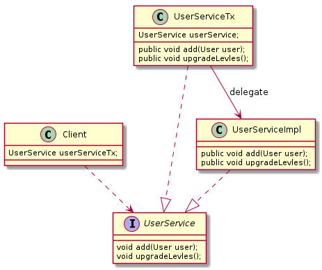

## proxy pattern
* target(최종적으로 요청을 처리하는 실제 object)에 대한 접근 방법을 제어하려는 목적
  * target을 생성하기가 복잡(생성 비용이 비싼 경우)하거나, 당장 필요하지 않은 경우에는 꼭 필요한 시점까지 object를 생성하지 않는 편이 좋다. (client에게 실제 target object를 넘기는 대신, proxy를 넘겨주는 것)
  * remote object를 이용하는 경우 (RMI, EJB 등)
  * 특별한 상황에서 target에 대한 접근 권한을 제어할 경우
* proxy pattern은 target의 기능 자체에는 관여하지 않고, 접근하는 방법을 제어해 주는 proxy를 이용하는 것
* 구조적으로 보면 decoreate(부가 기능)와 proxy(접근 제어 등)는 유사함, 다만 proxy는 코드에서 자신이 만들거나, 접근할 target class 정보를 알고 있는 경우가 많음



```java
public class UserServiceTx implements UserService {
   private TransactionManager transactionManager;
   private UserService userService;	// target object
   
   public UserServiceTx(UserService userService) {
      this.userService = userService;
   }
   
   @Override
   public void add(User user) {
      userService.add(user);
   }

   @Override
   public void upgradeLevels() {
      TransactionStatus status = transactionManager.getTransaction(new DefaultTransactionDefinition());
      
      try {
         userService.upgradeLevles();
         transactionManager.commit(status);

      } catch(RuntimeException e) {
         transactionManager.rollback(status);		
         throw e;
      }
   }
}   
```

```java
public Client {
	UserService userService = new UserServiceTx();
	userService.add(new User());
	userService.upgradeLevels();
}
```

#### In GoF...
* remote proxy
  * RMI, CORBA, XML/SOAP  등
  * network 연결의 한 종단에 존재, network의 다른 쪽에 있는 객체와 동일한 interface를 구현
* virtual proxy
  * 값 비싼 객체를 필요로 할 때 생성하는 proxy
  * lazy initialization
* protection proxy
  * 내부 객체에 대한 접근 제어
  * Collections.synchronizedCollection(), Collections.unmodifiableCollection() 등이 반환하는 Collection 인터페이스 구현체
* smart reference
  * java.util.WeakHashMap은 Weak Reference를 사용하며, proxy의 일종이라 할 수 있음.

### JDK Dynamic Proxy
* 프록시 사용은 좋은 발상이지만, 사용하기 불편하다. 매번 새로운 class 정의하고, interface의 구현 메소드가 많으면 모든 method 구현햇 위임하는 코드 만들어야 함.
* java.lang.reflect을 사용해 몇 가지 API를 이용해 proxy처럼 동작하는 object를 dynamic하게 생성하는 것
* invoke method는 method와 parameter정보만 있으면 특정 object의 method를 실행할 수 있음

```java
public class UserServiceTx implements InvocationHandler {
   private TransactionManager transactionManager;
   private Object target;

   public UserServiceTx(Object target) {
      this.target = target;
   }

   @Override
   public Object invoke(Object proxy, Method method, Object[] args) throws Throwable {
      if (method.isAnnotationPresent(Transactional.class)) {
         return executeTx(method, args);
      }
      return method.invoke(target, args);
   }

   private Object executeTx(Method method, Object[] args) {
      TransactionStatus status = transactionManager.getTransaction(new DefaultTransactionDefinition());

      try {
         Object result = method.invoke(target, args);
         transactionManager.commit(status);       
         return result;
         
      } catch(InvocationTargetException e) {
         transactionManager.rollback(status);
         throw e;
      }
   }
}
```

```java
public Client {
   UserService target = new UserServiceImpl();
   UserService userService = Proxy.newProxyInstance(target.getClass().getClassLoader(),
                             new Class[]{UserService.class},
                             new UserServiceTx(target));
   userService.add(new User());
   userService.upgradeLevels();
}
```

#### In Spring
* Spring AOP
* Spring `@Trasactional`