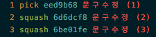

# git 자주 사용하는 command (in local repository)

### working directory에서 수정중인 파일 잠시 내부 stack에 올려놓기
    * 다른 branch로 자유롭게 이동~
```
$ git stash
```
* 이전 branch로 돌아와 다시 꺼내기
```
$ git stash pop
```  
### 의미없는 커밋이 여러개 올라가서 하나로 합치고 싶을 때
    * 예) 3개의 의미없는 커밋발생
```
$ git rebase -i HEAD~3
```
편집창 열리면, 합치고 싶은 메시지에 `squash` 변경 (pick -> squash로..) 후 저장


`pick`순서를 변경하면, 커밋 순서 변경도 됨 (complict 발생할 수 도 있음)
`pick hash code` 로 다른 커밋을 가져 올수도 있고...

### ````이미 커밋을 remote에 push했는데..마크업 수정이 계속 ....ㅠㅠ````
    * remote도.. rebase로 커밋을 머지할 수 있습니다.

```
$ git rebase -i origin/feature/10000~6 feature/10000
```

합치고,, remote로 forcely push
```
$ git push origin +feature/10000
```


### merge 브랜치 남기면서 merge
```
$ git checkout develop
$ git merge --no-ff feature/1000
```

### 커밋 롤백
```
$ git reset HEAD~
```

### 망함..커밋이 날아갔나??
    * git HEAD 변경이력으로... 없어지는 것은 하나도 없음..다시 돌아갈 수 있다..
        * git은 persistent 자료구조를 사용하니깐...
```
$ git reflog

    0e581d9 HEAD@{0}: commit: 3522 버그 수정
    31022ee HEAD@{1}: commit: 3522 partner_contract_type 테이블 제거 및 관련 class 제거, 수정
    3c92c89 HEAD@{2}: checkout: moving from develop to feature/3522

$ git reset --hard HEAD@{2}
```

### git 파일 대소문자 인식하지 않을 경우
```
$ git config core.ignorecase false
```

### remote repository의 특정 파일 삭제
    * 삭제 파일의 경로로 이동하여...
```
$ git rm --cached 파일명
$ git commit m "파일명 삭제함"
$ git push
```

---

### 전체 branch 목록
```
$ git branch -a
```

### branch clone
```
$ git clone 서버주소
```

### branch 신규 checkout
```
$ git checkout -b 생성할브랜치명 origin/브랜치명
```

### branch remote branch와 연결 상태
``` 
$ git branch -vv
```

### 리모트에 강제로 로컬의 branch로 override
```
$ git push --force
```

### 현재 리모트의 리스트
```
$ git remote -v
```

### 브랜치 로그 차이점 확인
```
$ git log --graph --pretty=format:'%Cred%h%Creset -%C(yellow)%d%Creset %s %Cgreen(%cr)%Creset' --abbrev-commit --date=relative {branch#1}..{branch#2}
```

### tag 여러개 삭제
```
$ git tag -l 'V0.1*' | xargs git push --delete <origin> # remote
$ git tag -l 'V0.1*' | xargs git tag -d # local
```

### 커밋한 메시지 수정
```
$ git commit --amend -m "커밋메시지 "
```
