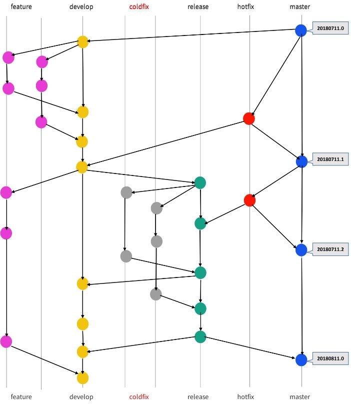
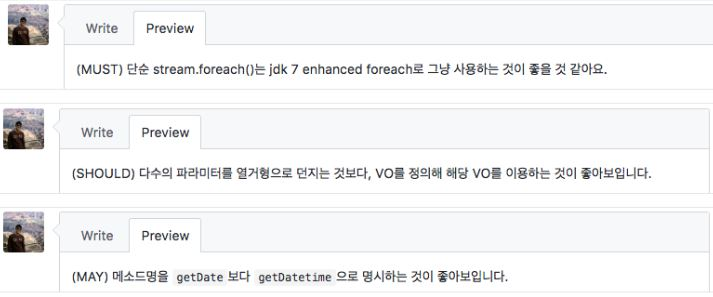
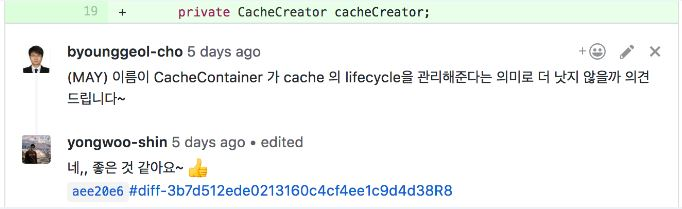

## git branch 관리와 코드 리뷰 전략!

"git으로 코드 형상을 관리하고 github를 통해 코드 리뷰를 진행한다." 
이는 하나의 공식처럼 git과 github는 개발자에게 있어서 필수적인 개발 아이템이 된 것 같아요.

이처럼 대부분 git과 github를 사용하고 계실 텐데요. git branch의 생성을 시작으로 "개발 -> Pull Request(PR) -> 코드 리뷰 -> merge"는 일련의 process로 정립되었습니다. 그런데 git branch의 관리와 코드 리뷰 방식은 딱히 정해진 규약이 없어 저마다 다른 방식으로 진행할 수 있겠죠?
혼자 개발하는 프로젝트가 아닌 이상, branch의 명칭만 보아도 특정의 분석 없이 팀원들이 인지하고 쉽게 이슈를 찾을 수 있도록 기준을 세우는 것은 중요한 요소라 생각됩니다.


### git branch 관리 전략
git-flow(https://nvie.com/posts/a-successful-git-branching-model/) 전략을 기본으로 1개의 branch를 추가하여 관리하고 있습니다.



main branch와 support branch를 구분해서 사용하자는 것인데요. main에는 master, develop이 있고 support에는 feature, release, hotfix, 그리고 coldfix가 있습니다.

* master 제품으로 출시된(할) branch
* develop 다음 버전으로 출시할 제품을 개발하는 branch
* feature 기능 개발을 하는 branch
* release 제품 출시 전 QA를 진행하는 branch
* hotfix 출시한 제품(master)에서 발생한 bug를 수정하는 branch
* coldfix QA 중 발견된 bug이거나 QA 중 반영하지 못한 이슈를 개발(수정)하는 branch

coldfix는 feature로 대체할 수도 있지만, release에서 생성하고, release로 merge 되어야 하는 branch임을 명칭만 봐도 인지하기 위해 추가되었습니다.

`main branch에서는 직접 코드를 수정해서 commit 하는 행위는 금기하고 있습니다.` 코드 수정은 반드시 support branch에서 해야 하고 support는 main에 merge 되면 local과 origin 모두 삭제합니다

support branch 중에서도 코드 개발은 feature, coldfix, hotfix 에서만 합니다. release는 support branch이지만 QA를 위한 static한 성격이므로 해당 branch에서는 직접 코드를 수정하지 않습니다.

`support branch를 어디서 생성하고 어디로 merge 해야 하는 가의 원칙 준수는 중요합니다.` 

* feature develop에서 생성하고, develop으로 merge.
* release develop에서 생성하고, develop과 master에 merge.
* coldfix release에서 생성하고, release로 merge.
* hotfix master에서 생성하고, develop과 master에 merge.

coldfix의 경우, 작업 완료 후 release로 merge 하는데요. merge 후, release를 develop으로 merge 하는 것을 권장하고 있습니다.

### 작업 시나리오
minor 한 코드 개발(수정)일지라도 반드시 `이슈`로 등록하여 support branch/이슈 번호의 계층 구조로 생성합니다. (release는 제품 출시 전 QA를 진행하는 branch이므로 release/제품출시 일자로 생성합니다) 
모든 이슈는 코드 변경 사항이 하나의 commit으로 수렴될 수 있는 작업 단위로 쪼갭니다. 의미 있는 commit의 경우가 아닌 이상, 코드 리뷰에 방해가 되므로 git rebase로 하나의 commit으로 합치고 있습니다.

* feature/1000
* coldfix/1100
* hotfix/1200
* release/20181227

기능 개발을 위해 `이슈`를 등록하고 해당 이슈 번호로 feature를 생성합니다.
```
$ git checkout -b feature/1000 origin/develop
```


해당 feature에서 코드를 개발(수정)하고, 변경사항을 commit 합니다.
```
$ git commit -m "인증 개발"
```

의미 없는 commit이 발생할 경우, rebase를 통해 commit을 하나의 commit으로 합치기도 합니다.
```
$ git rebase -i feature/1000~2
```

참고) rebase를 해야 하는데, origin으로 벌써 push를 했을 경우, rebase후, force로 origin에 바로 push 합니다.
```
$ git rebase -i origin/feature/1000~2 feature/1000
$ git push origin +feature/1000
```

개발 완료 후, 개발 branch를 origin에 push 합니다. 
```
$ git push origin feature/1000
```

`branch를 생성하고 origin에 push한 모든 코드는 반드시 PR을 생성합니다.` 코드 리뷰를 위해 github에서 해당 branch의 PR를 생성하고, `자신의 PR은 스스로 merge하고 있습니다.` 이는 merge 시, collision이 발생할 수 있는데 이에 대한 책임과 역할 수행을 PR을 올린 당사자가 직접 해결해야 한다는 의미도 내포하고 있습니다.

코드 리뷰 완료 후, 이력을 남기기 위해 --no-ff 옵션을 이용하여 merge 합니다.
```
$ git checkout develop
$ git merge --no-ff feature/1000
``` 

참고) 코드 리뷰를 위해 PR이 요청된 branch로 이동해야 할 경우가 종종 있을 텐데요. 이때 개발(수정) 중인 코드가 존재할 경우 이동이 불가할 경우가 있습니다. 이때는 stash를 이용하여 git local stack에 잠시 쌓아 두었다가 코드 리뷰 완료 후, 다시 돌아와 pop으로 다시 꺼낼 수 있습니다. 아주 유용한 명령입니다.
```
$ git stash

// 코드 리뷰를 위해 이동하고, 다시 작업 중인 branch로 돌아와서 pop을 실행합니다.
$ git stash pop
```

### 코드 리뷰 원칙
PR은 코드 리뷰 원칙을 준수하고 있어요. github의 기능적 요소를 사용하여 review 후 merge를 위한 제약 사항을 지정할 수도 있지만, 코드 리뷰가 더딜 경우 긴급하게 merge가 되어야 할 상황을 고려하여 해당 기능을 사용하지는 않습니다. 단, 이럴 경우, `later PR` TAG를 명시하고 merge 이후에 코드 리뷰를 진행합니다.

1. merge는 스스로 진행하고, PR의 reviewer 과반수가 을 댓글로 남겼을 때만 merge를 진행합니다.
제약사항은 구성원 스스로 원칙을 준수하도록 서로서로 규제하고 있습니다.

2. review 작성 시, reviewer의 견해를 짐작할 수 있도록 review의 level을 지정하고 있습니다. review에는 해야 하거나 (MUST), 해도 되거나(SHOULD), 안 해도 되는(MAY) 의견이 있을 텐데요. review가 글로 표현되다 보니, review를 받는 당사자의 경우, 모든 review를 자칫 해야 하는 review로 오인하여 감정이 상하거나, 코드 리뷰 속도가 늦어지는 경우가 종종 있었습니다.


| Level | 설명 |
| --- | --- |
| MUST | 주로 technical 적 요소로 반드시 수정되어야 하는 경우, 작성자가 다른 견해를 가질 수 있으므로, 토론이 필요할 수 있다. |
| SHOULD | 주로 architecture 적인 요소로 reviewer의 추천, 추천이 참일 수도 있고, 거짓일 수도 있으므로, 토론이 필요할 수 있다. |
| MAY | reviewer의 주관적인 요소로 작성자의 선택에 의해 반영되므로, 토론이 필요 없다. |




review 중에 MUST가 없으면 빠른 merge를 위해  바로 기재합니다.
review에 level을 지정해보니, 코드 리뷰를 요청한 당사자에게 reviewer의 견해를 인지할 수 있어 코드 리뷰 속도가 빨라지는 경험을 할 수 있었습니다.

3. 코드 리뷰가 더딜 경우, 매일 아침 오프라인으로 코드 리뷰를 권유하고 있습니다.
4. 코드 리뷰에는 반드시 답글을 달고, github의 index 기능을 이용하여 수정한 코드의 링크를 기재하여, reviewer에게 review의 피드백을 빠르게 인식할 수 있도록 합니다.



### 마무리
git branch 관리, 코드 리뷰 방식은 정해진 답은 없습니다. 다만, 협업에 있어 서로서로 branch 명만 봐도 의미가 통하고 그 행위를 인지할 수 있다면 그만큼 큰 효과가 없을 거라 판단됩니다. 또한, 코드 리뷰 역시 다양한 관점의 방법론이 존재하지만, review 시 level을 지정함으로써 review를 받는 사람이 reviewer의 의견을 정확히 인지하여 더욱 원활히 코드 리뷰를 진행할 수 있을 거라 판단됩니다. 
팀원 서로서로 의미가 통하는 하나의 전략으로 방법론을 만들어 git branch를 관리하고, 더 원활한 코드 리뷰 문화를 정착해 나갈 수 있으면 좋겠습니다. ^^