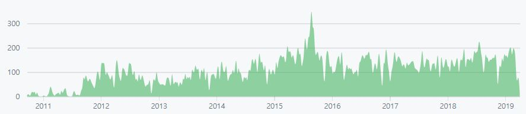
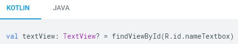
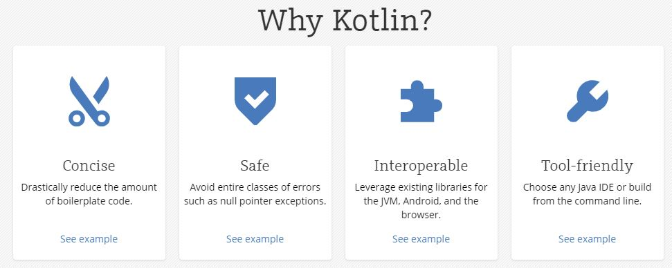

## Kotlin을 써야 할까요?

### 배경
* 2009년 SUN ORACLE 인수
* 2010년 ORACLE GOOGLE java 저작권 침해 소송 제기 (10조 배상 요구)
(google이 android를 만들면서 java api 137개를 무단 도용)
* 2016년 10월 ORACLE 승소
  
### Kotlin 역사 
* Nov 7, 2010 ~ May 21, 2019
 
  
  * 2011년 7월 19일 jetbrains kotlin 발표
  * 2016년 2월 15일 v1.0 release
  * 2017년 5월 18일 google I/O 공식 언어로 지정
    * [android 공식 문서의 예제 코드: kotlin이 main으로 제공](https://developer.android.com/guide/topics/resources/layout-resource?hl=ko#kotlin)
    
  * 2019년 4월 12일 v1.3.30 release
  
### JAVA 한계  
* [Android 는 jdk 6 기반으로 만들어진 언어, jdk 8 지원 제한 (특정 버전 Nougat 이상부터 지원)](https://developer.android.com/guide/platform/j8-jack.html?hl=ko)
* Boilerplate 코드 많음
    
### [Why Kotlin](https://kotlinlang.org/)
 

#### Concise
* data class

  * java
    ```java
    public class Customer {    
        private String name;
        public void setName(String name) {...}
        public String getName() {...}
        
        // contructor
        // toString()
        // equqals()
        // hashCode()
    }
    ```
    
  * kotlin
    ```kotlin
    data class Customer(val company: String)
    ```

* verbose 하지 않는 코드 생성 가능
```kotlin
val positiveNumbers = list.filter { it > 0 }

object ThisIsASingleton {   // Singleton
    val companyName: String = "JetBrains"
}
```

#### Safe
* nullable, non-nullable 타입으로 Null safety
```kotlin
val output: String = null   // Compilation error

val output: String? = null  // Nullable type
println(name.length())      // Compilation error

fun calculateTotal(obj: Any) {
    if (obj is Invoice)
        obj.calculateTotal()
}
```

#### Interoperable
* java solution 과의 연동
* java 100% 호환

#### Tool-friendly 
* android studio, intellij (jetbrains)
  * `java to convert kotlin` (copy & paste) 

### Kotlin Syntax
##### 변수 선언
```kotlin
var count: Int = 10
count = 15

val languageName: String = "Kotlin"
val languageName = "Kotlin"     // type inference
```  

##### 조건부
```kotlin
val answerString: String = if (count == 42) {   // expression not statement
    "I have the answer."
} else if (count > 35) {
    "The answer is close."
} else {
    "The answer eludes me."
}
```

```kotlin
val answerString = 
    when {
        count == 42 -> "I have the answer."
        count > 35 -> "The answer is close."
        else -> "The answer eludes me."
    }
```

##### 함수 선언
```kotlin
fun generateAnswerString(countThreshold: Int): String = if (count > countThreshold) {
        "I have the answer"
    } else {
        "The answer eludes me"
    }
```

##### extension functions
```kotlin
fun main() {
    val stringList = listOf("hello", "world")
    println(stringList.joinToString(","))
}
```

```kotlin
data class Order(val id: Long, val account: Account, val items: List<OrderItem>) {
    val amount: Long
        get() = items.asSequence().map { it.amount }.sum()
}

data class Account(val id: Long, val name: String, val email: String)
data class OrderItem(val id: Long, val name: String, val amount: Long)


fun Order.names(): String { // extension functions
    return "${account.name}: ${items.map { it.name }.joinToString(", ")}"
}
```

##### string interpolation
```java
String.format("account is name: %1%s, address: %2%s", name, address);
logger.debug("account is name: {}, address: {}", name, address);
```

```kotlin
logger.debug("account is name: $name, address: $address")
```

##### higher-order functions (first-class citizen)
1. 함수를 `변수나 데이터에 할당`
2. 함수를 `파라미터로 전달`
3. 함수를 `리턴 가능`

```kotlin
fun print(body: (Int, Int) -> Int) {
  println(body(1, 2))
}

fun sum(a: Int, b: Int) = a + b
fun minus(a: Int, b: Int) = a - b
fun multiply(a: Int, b: Int) = a * b
fun division(a: Int, b: Int) = a / b

@Test
fun test() {
  print(::sum)
  print(::minus)
  print(::multiply)
  print(::division)
}
```

##### smart cast
##### elvis operator
* java
```java
if (order != null) {
    if (order.getAccount() != null) {
        if (order.getAccount().getOrderItems() != null) {
            OrderItem orderItem = order.getAccount().getOrderItems().get(0);
            return orderItem.getName() == null ? "" : orderItem.getName();
        }
    }
}
```

* kotlin
```kotlin
var value = order?.getAccount()?.
```
##### coroutines


### Effective Kotlin
* 싱글톤은 object 키워드를 통해 선언      
* util class는 `Top Level Function`을 사용
* kotlin에는 wrapper class(delegate 패턴)를 `by 키워드`를 통해 간단히 구현 가능
* 상속이 필요한 이유가 있을 때만 상속을 허용하자. (`open` class Parent)
* 필드에서 getter, setter를 선언할 수 있으므로, 접근자 메소드를 직접 정의하지 않아도 된다.
* 오버라이딩 할 경우, `override` 키워드를 무조건 선언해야 함.
* 변경 가능성을 최소화 하라. (`default final`)
* complier를 통해 boxing 여부를 결정하며, 필요한 경우 외에는 primitive type 사용
```kotlin
var a: Int = 3  // private static final int a = 3;
val b: Int? = 3 // @Nullable private static final Integer b = 3;
```

* kotlin은 Checked Exception이 없음, 그와 상관없이 예외를 무시하지 마라
* Delegated properties(`by lazy`)로 지연 초기화를 쉽게 구현할 수 있음
  * 사용시엔 동기화 수준을 최소화해서 호출하자.
  
### Kotlin Performance
* 성능은 동일
  
###  Kotlin 고려 사항
* 컴파일 시간 증가 (신경쓸 정도는 아님)  
* Bytecode 증가
  * inline 함수 (compile 시, inline class로 변경됨): 함수형 타입 메소드
  * null 체크