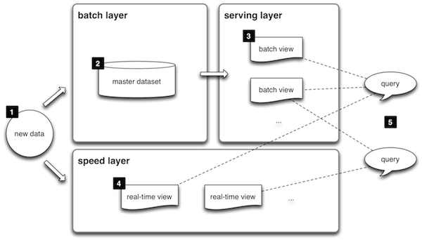

# 2장. 마이크로서비스 관련 아키텍처 스타일 및 사례

## SOA (Service Oriented Architecture)

* 서비스 지향성을 지원하는 아키텍처 스타일
    * 느슨하게 결합될 수 있고, 재활용도가 높은 서비스에 기반하여 application을 개발하고자하는 아키텍처 모델
    * 마이크로서비스와 차이점은?
        * SOA에 어떤 방식으로 접근하느냐에 따라 달라진다.
            * 서비스 지향 통합 (`모든 기업 서비스는 ESB를 통해 배포되므로, 마이크로서비스와 다름.`)
                * 
                * 각 application은 http, JMS에서 동작하는 SOAP/XML 가반의 웹 서비스(`SOA를 실현시키는 방법`) 같은 메시지 형식과 protocol을 사용하는 어떤 공용의 통합 계층을 통해 교환
                    * 
            * 서비스 지향 application (`마이크로서비스는 SOA의 논리적 다음 단계`)
                * 횡단 관심사 문제를 처리하기 위해 apache camel, spring integration같은 경량 통합 framework(jar)를 application 내부에 포함
                    * esb는 솔루션임, 컨테이너가 있음 (즉, 서버 자원 필요)
            * SOA를 사용한 일체형의 전환
                * application을 작은 크기의 물리적으로 배포 가능한 하위 시스템으로 분리, 웹 archive로 만들어 웹 서버에 배포, jar 만들어 자체 컨테이너게 배포         

*  구현 기술의 변화

| webserivce | micro service | 
| --- | --- | 
| ESB | API platform |
| UDDI | API portal |
| XML/SOAP | JSON/HTTP |
| webservice | REST | 

## 12 factor application
* cloud native
    * 클라우드 환경에서 효츌적으로 작동하고, 탄력성, 사용량 기반 과금, 장애인식 등 클라우드 특징 인식하고 활용할 수 있는 application을 개발하는 것
    
1. 단일 코드 베이스
    * 각 application이 하나의 code base만을 가져야 함 (git)
        * 하나의 micro service는 정확히 하나의 code base를 가진다.
2. 의존성 꾸러미
    * 모든 application은 필요한 모든 의존성을 하나의 꾸러미에 담아야 한다. (maven, gradle)
3. `환경설정 외부화`
    * 모든 환경설정 parameter를 코드와 분리해서 외부화하라고 권고함
    * micro service 환경설정 parameter는 외부의 소스에서 읽어 와야 한다.
4. 후방 지원 서비스 접근성
    * `모든 서비스는 URL로 접근 가능해야 한다.`
        * tcp, http, smtp, jdbc...
5. 빌드, 출시, 운영의 격리
    * 빌드: 모든 필요한 자원을 포함해서 compile, binary를 만들어 내는 과정
        * 실행가능한 jar 파일 생성 (http 리스너와 같은 서비스 runtime 환경도 포함: embedded tomcat, netty ..)
    * 출시: binary를 환경설정 parameter와 혼합하는 과정
        * 실행 jar파일과 환경 설정 정보가 합침.. docker와 유사한 container로..만들어짐
    * 운영: 특정 실행환경에서 application을 운영하는 것
        * container를 컨테이너 스케쥴러에 의해 운영환경에 배포
6. `무상태, 비공유 프로세스`
    * 모든 micro service는 상태가 없는 기능을 기반으로 설계되어야 한다.
    * 상태를 저장해야 한다면 DB, in-memory cache를 사용
7. 서비스를 포트에 바인딩해서 노출
    * 이상적인 12 요소 application은 `외부의 웹서버에 의존하지 않는다.`
    * tomcat, jetty같은 http 리스너는 서비스나, application 자체에 내장되어야 한다.
    * 독립 설치형이어야 한다.
8. 확장을 위한 동시성
    * 복제를 통해 process가 확장될 수 있게 설계해야 한다.(scale out)
    * 병렬 프로세싱과 동시성 지원 framework를사용해 scale up도 가능
9. 페기 영향 최소화
    * application의 시동과 종료에 필요한 시간을 최소화하고, 서버가 종료 시 종료에 필요한 작업이 모두 수행되는 `gracefully 방식으로 종료`되게 만들어야 함 (thread join())
    * micro service에서는 객체와 data의 lazy loading에 대해서도 고려..
10. 개발과 운영의 짝 맞춤
    * 개발 환경과 운영 환경을 가능한 동일하게 유지하는 것이 중요
11. 로그 외부화
    * 로그 파일을 자신 안에 담지 않는다.
    * `중앙 집중식 로깅 framework를 사용해 로그를 한 곳에 모음` (like logNcrash...)
        * micro service에는 매우 중요! 각 서비스의 로그 사아의 연관성
12. 관리자 프로세스 패키징
    * health check, model 확인 등 관리자 task 영역도 함께 출시돼야 함
    
## [Serverless 컴퓨팅](https://aws.amazon.com/ko/serverless/)
* 개발자가 application server, 가상머신, container, infrastructure, 확장성 등 고민할 필요 없음
    * 서버 관리 불필요
    * 유여한 규모 조정
    * 자동화된 고가용성
* 비즈니스 로직을 담고 있는 method를 작성해 현재 실행되고 있는 computing infrastructure에 떨구면 됨
* NoOps라고 불리기도 함
* 다수의 플랫폼, framework 존재
    * 플랫폼
        * 관리형 infrascture
            * AWS lambda
            * IBM OpenWhisk
            * Azure function
            * google cloud function
        * redhat의 function
        * ironFunction: cloud 종속성 제거
        * webtask: 웹 관련 기능을 담음
        * BrightWork: 벤더 종속성을 최소화한 javascript application용
    * framework
        * Apex
        * Serverless
        * 자바용 lambda framework
        * 파이썬용 chalice
        * nodeJS용 Claudia
        * go용 sparta, gordon
* serverless 컴퓨팅의 함수도 한 번에 하나의 임무만 수행, 외부와 격리, event 기반, http 기반의 API를 통해서만 외부와 통신함
* 벤더 종석성이 강한 특징 (단점)

## [람다 Architecture](http://bcho.tistory.com/984)
* 실시간 big data 분석 아키텍처
    * 데이터를 실시간으로 분석할 때, batch layer에서 만든 data와 실시간으로 갱신되는 data를 함께 계산해서 빠르게 분석 할 수 있게 하는 것이 목표

* batch layer (장기..)
    * raw 데이터가 저장(HDFS)되어 있고, batch 처리(Map reduce)하여 배치 뷰(HBase) 생성
* serving layer
    * batch로 분석된 데이터가 저장되어 있고 batch 외에는 쓰기가 안됨
* speed layer (단기...)
    * 실시간 데이터를 집계
    * reactive micro service로 구현
    * storm으로 실시간 처리 -> redis

* 인지컴퓨팅
    * 예보서비스, 예측서비스, 추천 서비스 같은..
    * algorithmia
* big data
    * MapR
* bot
    * Azure
* IOT
    * Predix

## 데브옵스, 클라우드, micro service
* 목표: 신속한 제품인도, 비즈니스 가치, 비용 편익 
* `micro service`는 신속한 변경, 배포를 가능하게 하는 아키텍처 스타일
* `데브옵스`
    * 애플리케이션과 서비스를 빠른 속도로 제공할 수 있도록 조직의 역량을 향상시키는 문화 철학, 방식 및 도구의 조합
        * 지속적 통합 및 지속적 전달
        * 마이크로 서비스
        * 코드형 인프라
        * 모니터링 및 로깅
        * 서비스로서의 플랫폼
        * 버전 제어
    * micro service 변경 및 배포를 위한 든든한 버팀목 같은 process와실천 방식을 제공해줄 수 있는 이상적인 후보
    * 자

## Reactive Micro service
* `비즈니스 범위를 기반으로.. 서비스를 어떻게 격리하고 어떻게 통신할지 결정하는 것이 중요`
* sync 호출 방식은 서비스 사이에 강한 의존 관계 형성.. micro service를 성공적으로 구현하려면 reactive style 도입하는 것이 중요
* reactive programming의 중요 특징
    * resilient
    * responsive
    * message driven
    * elastic
* `서비스 사이의 통신을 `[비동기 non-blocking](https://homoefficio.github.io/2017/02/19/Blocking-NonBlocking-Synchronous-Asynchronous/)` 호출을 사용하는 reactive style로 설계하는 것이 대단히 중요`
    * 
* reactive micro service에서 흐름제어는 메시지와 이력 및 출력에 대한 micro service 사이의 계약이 흐름 방식을 결정함.
    * QBit, spring reactive, Rxjava, RxJS 많이 사용
    * spring 5는 reactive web application을 개발할 수 있는 기능 내장됨
        * spring cloud stream 사용하는 것이 좋음

## Micro service 사례
* 확장성, 유지 관리성, 애자일성, 변경 및 배포 속도의 개선이 필요해서 일체형 application을 전환하는 경우
    * netflix
    * uber
    * Aribnb
    * Orbitz
    * eBay
    * Amazon
    * Gilt
    * Twitter
    * Nike
* 눈에 보이는 화면이 없는 비즈니스 application이나 service들..
    * 결제 서비스, 로그인 서비스, 항공편 검색 서비스 등이 적합
    * 통신 서비스, 암호화 서비스...
* `폴라그잇`을 요구하는 application

## Micro service framework
* 외부화된 로깅, 내장 http 리스너, 헬스 체크 등 공통적으로 구현해야 할 횔당 관심사... 지원
    * 기업 수준의 http/rest micro service를 개발할 때 널리 사용
        * spring boot + spring 5
        * dropwizard
        * wildfly swarm
* lightbend의 `lagom`
    * java, scala롤 micro service를 개발할 때
* WSO2의 `MSF4J`
    * 경량, 고성능 micro service framework
* `spark`
    * rest 서비스 개발할 때
* `seneca`
    * nodejs로 rest 서비스를 쉽고 빠르게 만들수 있는 toolkit
* `vert.x`
    * reactive micro service를 빠르게 만들수 있는 Polyglot toolkit
* `restlet`
    * rest 기반 api를 빠륵 효율적으로..
* `payara-micro`
    * war 파일로 된 web application을 만들고, glasfish에서 실행
* `jooby`
    * rest 기반 api를 만드는데 사용되는 웹 framework
* `go-fatship`
    * rest 서비스 개발에 사용되는 고성능 http package
* `javalite`
    * http 종단점을 중심으로 application을 만드는데 사용
* `mantl`
    * 시스코에서 만든 오픈소스 framework
* `fabric8`
    * redhat에서 지원하는 project
* Hook
* `vamp`
    * 컨테이너 기반의 micro service를 관리하는데 사용되는 오픈 소스
* `go kit`
    * go 언어로 만들어긴 표준 library
* micro
    * go 언어로 된 toolkit
* lumen
    * 경량 고속 framework
* restx
    * 경량 rest 개발 framework
* gizmo
    * go 언어로 된 reactive framework
* azure service fabric
    * MS에서 만든 개발 platform