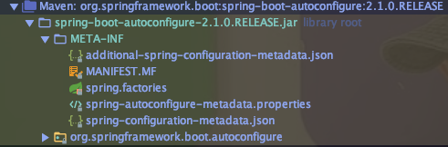

### 13.1 Dependency Management 가능
https://docs.spring.io/spring-boot/docs/2.1.3.RELEASE/reference/html/using-boot-build-systems.html#using-boot-dependency-management

##### pom.xml
```xml
<parent>
    <groupId>org.springframework.boot</groupId>
    <artifactId>spring-boot-starter-parent</artifactId>
    <version>2.0.3.RELEASE</version>
</parent>
```

* resource filtering
* source encoding 등..

### 2. 의존성 관리 활용
* https://mvnrepository.com/

### 3. 자동 설정 순서
* @SpringBootApplication > @EnableAutoConfiguration
* Bean 읽는 순서: @ComponentScan -> @EnableAutoConfiguration

* @ComponentScan
    * @Component
    * @Configuration @Repository @Service @Controller @RestController
    
* @EnableAutoConfiguration (추가적인 Bean 들..) 
    * spring.factories (org.springframework.boot.autoconfigure.EnableAutoConfiguration)
    * @Configuration
    * @ConditionalOnMissingBean ...
    


예) WebMvcAutoConfiguration

참고) 
* DispatcherServlet
* DI
* web server 동작하지 않고, 실행하기
```java
SpringApplication app = new SpringApplication(Application.class);
app.setWebApplicationType(WebApplicaitonType.NONE);
app.run(args);
```

### 4. 독립적으로 실행 가능한 JAR
* spring-maven-plugin이 해주는 일 (패키징)
```xml
<build>
    <plugins>
        <plugin>
            <groupId>org.springframework.boot</groupId>
            <artifactId>spring-boot-maven-plugin</artifactId>
        </plugin>
    </plugins>
</build>
```

https://docs.spring.io/spring-boot/docs/current/reference/html/executable-jar.html

* 많은 의존성 library.jar는 어떻게 관리할까?
    * java는 nested jar 파일을 loading하는 표준적인 방법이 존재하지 않는다.
    * springboot이전에는 `uber.jar`를 사용하여 모든 class를 하나의 jar로 압축했음 
        * 동일 class의 경우, 충돌 발생 가능높음
        * 어떤 library를 쓰는지 확인하기 어려움)

* springboot loader-compatible jar files
    * 애플리케이션 클래스와 라이브러리 위치 구분
        * `org.springframework.boot.loader.jar.JarFile`을 사용해서 내장 JAR를 로딩
        * `org.springframework.boot.loader.Launcher`를 사용해서 main() class 실행
        
    * mvn package로 생성된 jar를 `unzip -q example.jar`로 압축 풀면, 아래의 구조 확인
    ```
    example.jar
     |
     +-META-INF
     |  +-MANIFEST.MF
     +-org
     |  +-springframework
     |     +-boot
     |        +-loader
     |           +-<spring boot loader classes>
     +-BOOT-INF
        +-classes
        |  +-mycompany
        |     +-project
        |        +-YourClasses.class
        +-lib
           +-dependency1.jar
           +-dependency2.jar
    ```