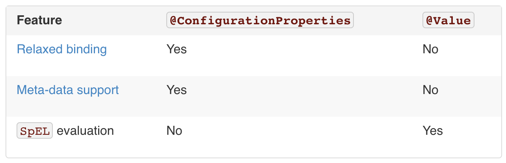

### 24. Externalized Configuration
https://docs.spring.io/spring-boot/docs/current/reference/html/boot-features-external-config.html

* To externalize configuration
  * properties files
  * YAML files
  * environment variables
  * command-line arguments

#### property 우선 순위
2. `@TestPropertySource` annotations on your tests
3. properties attribute on your tests. Available on `@SpringBootTest`
4. `Command line arguments`
9. `Java System properties` (System.getProperties())
10. OS environment variables.
12. `Profile-specific application properties` outside of your packaged jar (application-{profile}.properties)
13. Profile-specific application properties packaged inside your jar (application-{profile}.properties)
14. `Application properties` outside of your packaged jar (application.properties)
15. Application properties packaged inside your jar  (application.properties)
16. `@PropertySource` annotations on your @Configuration classe
17. Default properties (specified by setting SpringApplication.setDefaultProperties)

### 24.3 Application Property Files

1. A /config subdirectory of the current directory
2. The current directory
3. A classpath /config package
4. The classpath root

* 파일이름 및 파일 위치 변경 가능
  * spring.config.name = 
  * spring.config.location =
  
### 24.5 Placeholders in Properties
```properties
app.name=MyApp
app.description=${app.name} is a Spring Boot application
```  

### 24.7 Using YAML Instead of Properties
[SnakeYAML](https://bitbucket.org/asomov/snakeyaml) library on your classpath

### 24.8 Type-safe Configuration Properties
```java
@Component
@ConfigurationProperties(prefix="demo.app")
@Getter
@Setter
public class DemoProperties {
    private String name;
    private int version;
}
```

* To meta-data support
```xml
<dependency>
    <groupId>org.springframework.boot</groupId>
    <artifactId>spring-boot-configuration-processor</artifactId>
    <optional>true</optional>
</dependency>
```
#### 24.8.2 Relaxed Binding
* Camel case
* Kebab case
* Underscore notation

#### 24.8.4 Properties Conversion
* @DurationUnit
  * Duration   
* @DataSizeUnit
  * DataSize
  
#### 24.8.5 @ConfigurationProperties Validation
* JSR-303 javax.validation

```java
@ConfigurationProperties(prefix="acme")
@Validated
public class AcmeProperties {
	@NotNull
	private InetAddress remoteAddress;

	// ... getters and setters
}
```  

#### 24.8.6 @ConfigurationProperties vs. @Value


참고) [SpEL](https://docs.spring.io/spring/docs/4.2.x/spring-framework-reference/html/expressions.html#expressions)
```java
@Test
public void testSPEL() {
    String message = "my name is #{name}";
    SpelExpressionParser parser = new SpelExpressionParser();
    StandardEvaluationContext context = new StandardEvaluationContext(Person.builder()
                                                                            .name("yongwoo")
                                                                            .build());
    Expression expression = parser.parseExpression(message, ParserContext.TEMPLATE_EXPRESSION);
    String value = expression.getValue(context, String.class);

    assertThat(value).isEqualTo("my name is yongwoo");
}
```

### 25. Profiles
https://docs.spring.io/spring-boot/docs/current/reference/html/boot-features-profiles.html

```java
@Configuration
@Profile("production")
public class ProductionConfiguration {
	// ...
}
```
