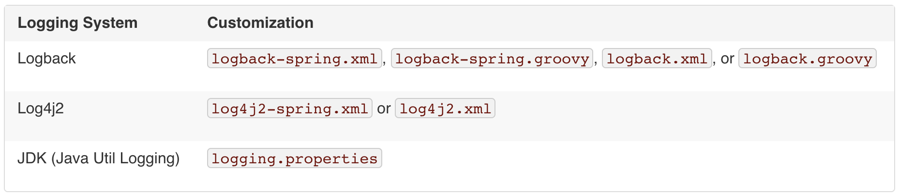

### 26. Logging
https://docs.spring.io/spring-boot/docs/current/reference/html/boot-features-logging.html

* Logging Facade VS Logger
  * Logging Facade
    * Commons Logging (runtime 시 사용할 Logger를 찾음, 성능 이슈) 
    * SLF4J
  * Logger
    * Java Util Logging
    * Log4J2
    * `Logback`

* [Spring-JCL](https://docs.spring.io/spring/docs/5.0.0.M5/spring-framework-reference/html/overview.html#overview-logging)
  * [Commons Logging -> SLF4J or Log4j2](https://github.com/spring-projects/spring-framework/wiki/What's-New-in-Spring-Framework-5.x#general-core-revision-2)
  * pom.xml exclusion 필요없음
  
#### 26.2 Console Output
* By default, ERROR-level, WARN-level, and INFO-level 
* with a --debug flag (embedded container, Hibernate, and Spring Boot)
* a --trace flag (or trace=true in your application.properties)

#### 26.2.1 Color-coded Output
* spring.output.ansi.enabled

#### 26.3 File Output
* logging.file : Specific file
* logging.path : Specific directory
* Log files rotate when they reach `10 MB`
  * logging.file.max-size
  * logging.file.max-history

#### 26.4 Log Levels
```properties
logging.level.root=WARN
logging.level.org.springframework.web=DEBUG
logging.level.org.hibernate=ERROR
```

#### 26.5 Log Groups
```properties
logging.group.tomcat=org.apache.catalina, org.apache.coyote, org.apache.tomcat
logging.level.tomcat=TRACE
```

#### 26.6 Custom Log Configuration


* we recommend that you use the `-spring` variants.
* [Configure Logback for Logging](https://docs.spring.io/spring-boot/docs/current/reference/html/howto-logging.html#howto-configure-logback-for-logging)

#### 26.7 Logback Extensions
* `<springProfile name=”프로파일”>`


